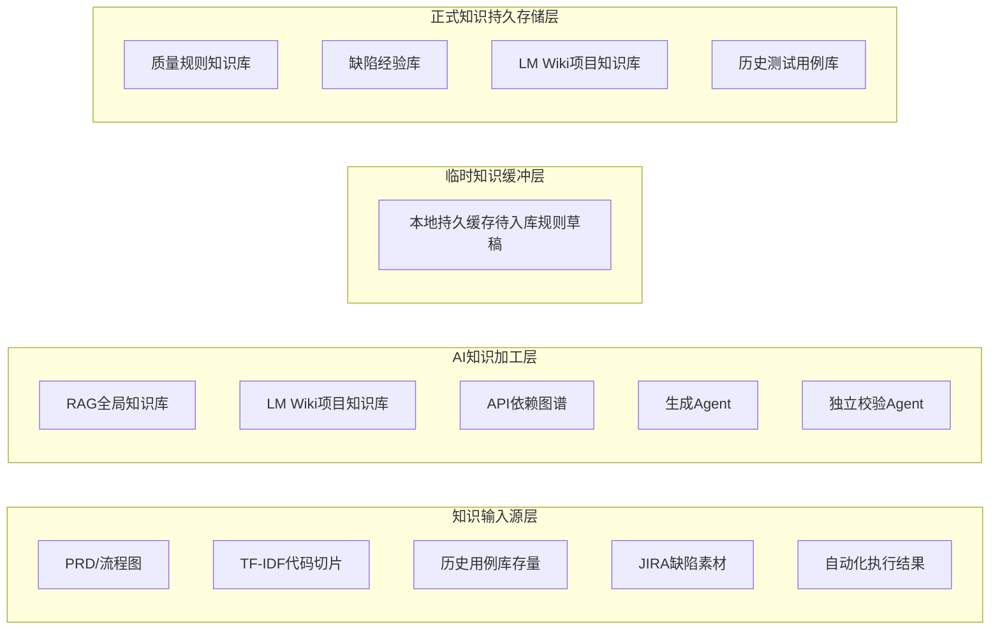
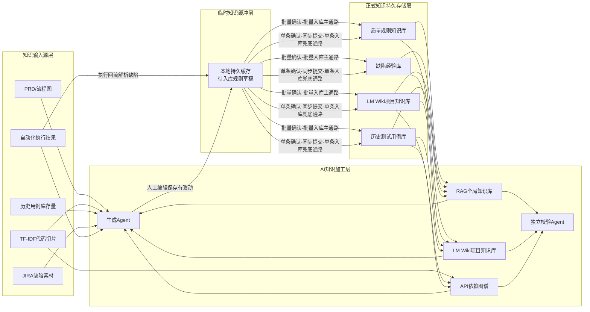
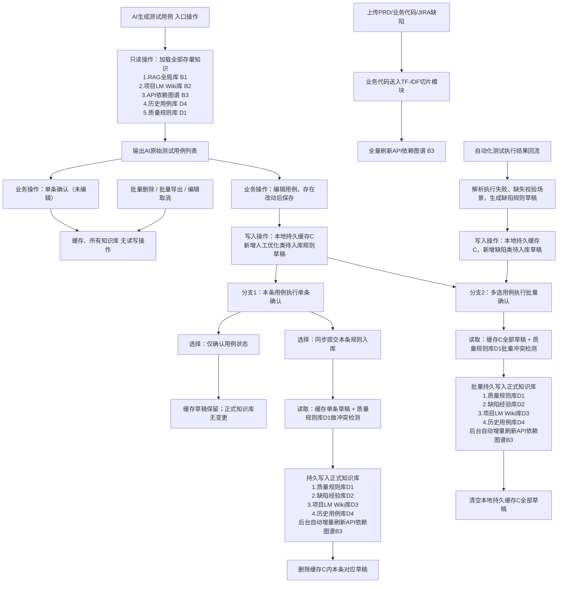

# AI测试用例自动生成系统\-知识闭环能力PRD

## 1\. 文档概述

### 1\.1 产品目标

搭建**可自我进化、数据闭环、知识可沉淀复用**的AI测试用例自动生成平台。区别于传统纯生成式工具，本系统以「知识数据流转」为核心，实现业务素材→AI加工→人工修正→规则沉淀→反向赋能AI生成的完整闭环，持续提升测试用例生成准确率、合规性、业务覆盖度。

### 1\.2 核心设计理念

- **面向数据复用，而非简单数据积累**：所有知识素材、人工修正、缺陷经验均可迭代复用

- **缓存分层缓冲机制**：临时规则草稿本地持久缓存，避免频繁写库，保证知识稳定性

- **双通路知识入库**：批量确认为主通路，单条提交为少量用例兜底通路

- **API依赖图谱动态自更新**：依托代码切片、历史用例、业务知识库自动迭代

- **读写严格隔离**：纯展示/删除/导出操作不参与知识数据流转

### 1\.3 范围界定

本文档仅定义系统**知识数据流转规则、AI加工逻辑、知识库读写机制、业务操作关联知识行为**；纯前端无数据变更操作（批量删除、批量导出、编辑取消、无修改确认）仅做业务交互，不纳入知识闭环体系。

## 2\. 系统总体架构

### 2\.1 系统四层架构总图

系统采用四层分层架构，自上而下完成原始素材输入、AI智能加工、临时知识缓冲、正式知识持久沉淀，形成完整可迭代的知识闭环体系。

### 2\.2 架构分层详细说明

#### 2\.2\.1 知识输入源层（原始数据供给层）

系统所有知识的原始来源，为AI加工提供完整业务、代码、缺陷、执行数据，仅做只读输入，不存储业务状态与迭代知识。

- A1 PRD/业务流程图：提供业务流程、状态机、需求约束、场景规范

- A2 TF\-IDF代码切片：对业务代码结构化切片，解析接口、方法、调用关联关系

- A3 历史用例库存量：项目迭代沉淀的标准测试用例集合

- A4 JIRA缺陷素材：历史缺陷案例、异常场景、问题复盘数据

- A5 自动化执行结果：用例执行通过/失败、缺失校验、边界遗漏等执行反馈数据

#### 2\.2\.2 AI知识加工层（核心计算与能力层）

依托存量知识库与动态图谱，完成测试用例智能生成、合规校验、业务依赖分析，是系统的核心能力载体。

- B1 RAG全局知识库：企业级通用业务知识，支持跨项目知识复用与通用场景用例生成

- B2 LM Wiki项目知识库：单项目专属业务逻辑、流程约束、自定义场景知识，保障用例贴合项目实际

- B3 API依赖图谱：动态维护接口调用顺序、前置后置依赖、参数关联关系，支撑用例步骤合规性

- B4 生成Agent：核心生成模型，依托全量存量知识自动输出测试点与测试用例

- B5 独立校验Agent：与生成Agent物理隔离，独立完成用例合规性、完整性、逻辑性准出校验

#### 2\.2\.3 临时知识缓冲层（中间态沉淀层）

唯一的知识临时存储媒介，用于承接未正式入库的增量知识草稿，规避频繁写库导致的性能与知识稳定性问题。

核心载体为**本地持久缓存**，页面刷新、系统重启不丢失数据，仅存储人工优化、执行回流产生的待入库质量规则草稿，不存储原始用例与存量知识。

#### 2\.2\.4 正式知识持久存储层（最终沉淀复用层）

系统可复用知识的最终落地载体，所有经过校验、审核的有效知识统一沉淀至此，反向持续赋能AI加工层，实现知识迭代进化。

- D1 质量规则知识库：存储用例编写规范、校验约束、准入准出核心规则

- D2 缺陷经验库：沉淀历史缺陷场景、异常边界、失效用例复盘经验

- D3 LM Wiki项目知识库：归档项目业务流程、专属场景、自定义约束知识

- D4 历史测试用例库：存储迭代沉淀的标准可用测试用例集

## 3\. 核心知识流转规则

本章先展示完整知识数据流转总图，再分步拆解各流转链路、触发条件、核心作用，全程聚焦**纯知识数据流转**，剥离无知识变更的业务操作。

### 3\.1 完整知识数据流转总图

### 3\.2 分链路流转详解

#### 3\.2\.1 API依赖图谱动态更新链路（后台自动知识迭代）

本链路为系统后台纯数据驱动逻辑，无人工手动维护，是保障用例步骤合规、依赖正确的核心底层能力。

- **全量更新**：业务代码更新后，TF\-IDF代码切片重新解析接口、方法调用关系，全量重构API依赖图谱骨架

- **业务增量更新**：LM Wiki项目知识库（D3）业务流程、约束更新时，自动修正接口前置、后置依赖逻辑

- **场景增量更新**：历史测试用例库（D4）新增沉淀用例后，补充真实业务调用分支、特殊依赖场景

**核心作用**：为生成Agent提供合规的接口调用顺序，为校验Agent检测步骤缺失、顺序错乱、参数缺失等问题，从底层规避用例逻辑错误。

#### 3\.2\.2 AI生成用例只读流转链路

AI生成用例的基础依赖链路，全程纯读取、无任何数据写入，保障生成内容基于全量存量知识。

流转过程：知识输入源层（PRD、代码切片、历史用例等）\+ AI加工层存量知识 \+ 正式库规则约束 → 统一输入至生成Agent、校验Agent → 输出合规原始测试用例。

**核心作用**：依托企业通用知识、项目专属知识、代码依赖、历史经验、质量规则，保障AI生成用例的覆盖度、规范性、合规性。

#### 3\.2\.3 临时知识草稿生成流转链路（增量知识产出）

系统仅有的两条增量知识产出链路，所有新知识均通过以下途径生成并暂存至本地持久缓存，不直接写入正式知识库。

1. **人工编辑优化链路**：AI生成用例后，用户编辑并产生有效改动、保存 → 系统自动对比原始用例，提取优化逻辑与校验规则 → 生成人工优化类规则草稿，写入本地持久缓存

2. **自动化执行回流链路**：自动化测试平台回传用例执行结果 → 系统解析失败场景、缺失断言、边界遗漏问题 → 自动生成缺陷类校验规则草稿，写入本地持久缓存

**核心作用**：实现增量知识统一缓冲，避免频繁写库，同时支持知识人工审核、冲突校验，保障沉淀知识质量。

#### 3\.2\.4 正式知识库入库双通路（知识落地唯一入口）

本地缓存草稿下沉至正式知识库的唯一通路，分为主通路和兜底通路，共用同一套冲突检测与合并规则，适配不同操作场景。

- **批量确认入库（主通路）**：读取全量缓存草稿 → 批量对比质量规则库完成冲突检测 → 人工处理合并/覆盖/丢弃 → 批量写入四大正式知识库 → 清空全量缓存 → 增量刷新API依赖图谱。适配大批量用例迭代场景。

- **单条确认同步提交入库（兜底通路）**：针对少量用例逐条操作场景，单条确认时选择同步入库 → 单条规则冲突检测 → 单条写入四大正式知识库 → 清除对应单条缓存 → 增量刷新API依赖图谱。

**核心作用**：统一知识沉淀标准，兼顾批量高效迭代与少量场景灵活操作，保障正式知识库数据一致性、有效性。

#### 3\.2\.5 全局知识闭环回流链路

正式知识库完成知识沉淀后，反向将新增/更新的业务规则、缺陷经验、场景知识同步赋能RAG全局知识库、LM Wiki项目知识库，参与下一轮AI用例生成与校验，实现**生成\-优化\-沉淀\-再生成**的持续进化闭环。

## 4\. 业务操作流转逻辑（与知识流转强对齐）

本章基于业务操作流程图，拆解用户前端操作对应的**知识读写行为、流转过程、环节作用**，所有业务逻辑严格对齐前文知识流转体系，明确区分「有知识变更操作」和「无知识变更操作」。

### 4\.1 完整业务操作流转总图

### 4\.2 业务流程分步拆解与知识联动说明

#### 4\.2\.1 素材初始化与图谱更新流程

用户上传PRD、业务代码、JIRA缺陷素材后，系统自动识别业务代码并送入TF\-IDF切片模块，全量重构API依赖图谱。本操作为知识体系初始化动作，为后续AI用例生成提供最新的代码依赖逻辑支撑，无正式知识库变更。

#### 4\.2\.2 AI用例生成业务流程

用户触发AI生成用例操作，系统一次性加载全局存量知识（RAG全局库、项目Wiki库、API图谱、历史用例、质量规则），通过双Agent完成生成与校验，输出原始AI用例列表。全程为**纯读知识操作**，不产生任何新知识与数据变更。

#### 4\.2\.3 无知识变更业务操作（无数据流转）

以下操作仅为前端业务交互，不读写缓存、不更新任何知识库，不参与知识闭环流转：无编辑直接单条确认、编辑取消、批量删除、批量导出、编辑保存后仅确认状态不入库。

#### 4\.2\.4 人工编辑缓存写入流程

用户编辑AI生成用例并产生有效改动、保存后，系统触发差异对比逻辑，生成人工优化规则草稿并写入本地持久缓存。本操作仅更新临时缓冲层，正式知识库无变更，实现增量知识暂存。

#### 4\.2\.5 自动化执行回流业务流程

自动化测试执行结果回传后，系统自动解析缺陷、缺失校验场景，生成缺陷类规则草稿并写入本地持久缓存，统一纳入待入库知识池，等待批量/单条确认落地。

#### 4\.2\.6 知识入库业务流程（双通路落地）

完全对齐知识流转双入库通路：批量确认适配大批量用例迭代，单条同步提交适配少量用例逐条优化场景，两类操作均完成「缓存读取\-冲突检测\-正式库写入\-缓存清理\-图谱增量更新」完整流程，是唯一能落地增量知识、迭代知识库的业务操作。

## 5\. 核心功能约束与产品规则

### 5\.1 缓存规则约束

- 缓存为**本地持久缓存**，页面刷新、重启系统不丢失未入库草稿

- 仅入库成功后，对应草稿会被清除（单条入库清单条、批量入库清全部）

### 5\.2 知识库冲突处理规则

- 所有入库动作必须前置**规则冲突检测**

- 冲突支持三种人工处理：合并规则、覆盖旧规则、丢弃新规则

### 5\.3 API图谱更新约束

- 代码变更触发**全量重构**

- 知识库业务数据变更触发**增量更新**

- 无人工编辑入口，完全后台数据驱动

### 5\.4 知识沉淀优先级

可用性优先于数量：系统只沉淀人工校验、执行验证过的有效规则，杜绝无效海量垃圾知识堆积。

## 6\. 版本迭代规划（贴合前期沟通纪要）

### 6\.1 V1\.0 轻量化版本

以Markdown文档完成知识积累，跑通完整数据闭环、双入库通路、缓存机制、API图谱基础能力，保证知识可沉淀、可复用。

### 6\.2 V2\.0 性能升级版本

迭代升级向量数据库、图数据库，优化知识检索召回率、多用户读写效率、图谱计算性能。

> （注：部分内容可能由 AI 生成）
