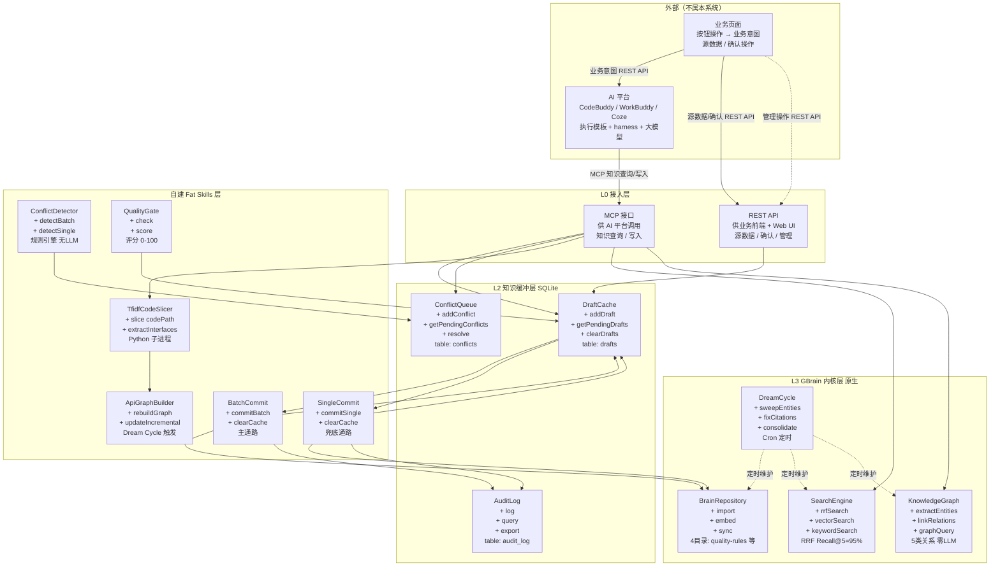
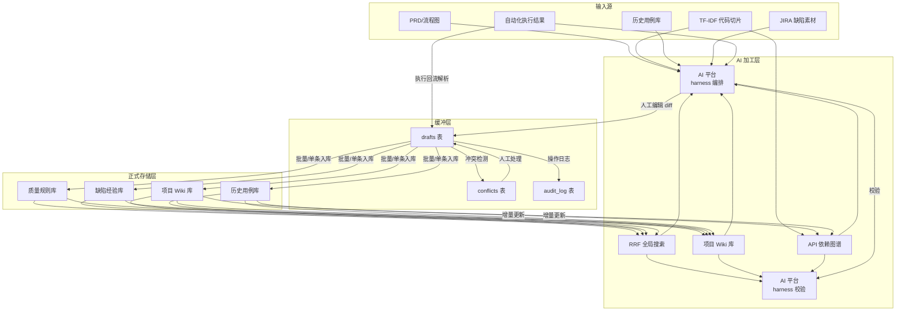
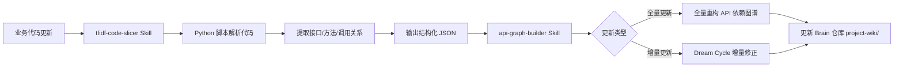
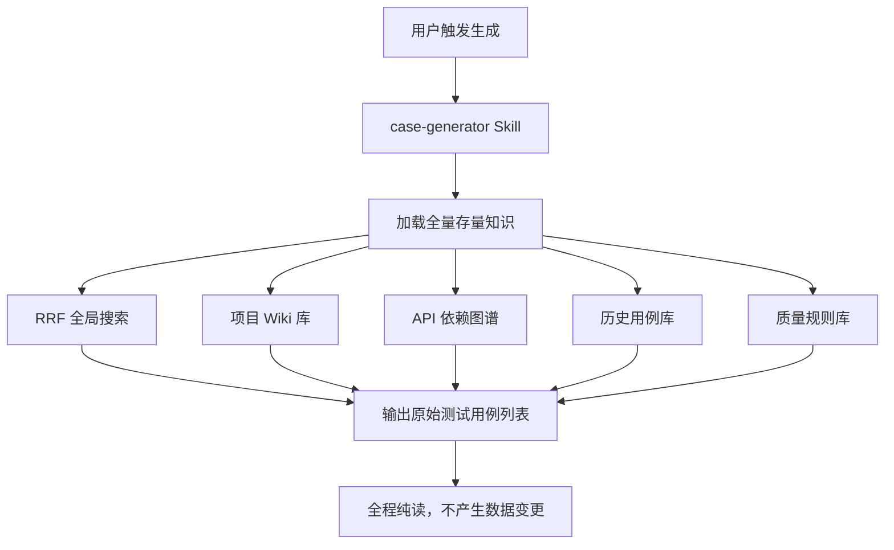
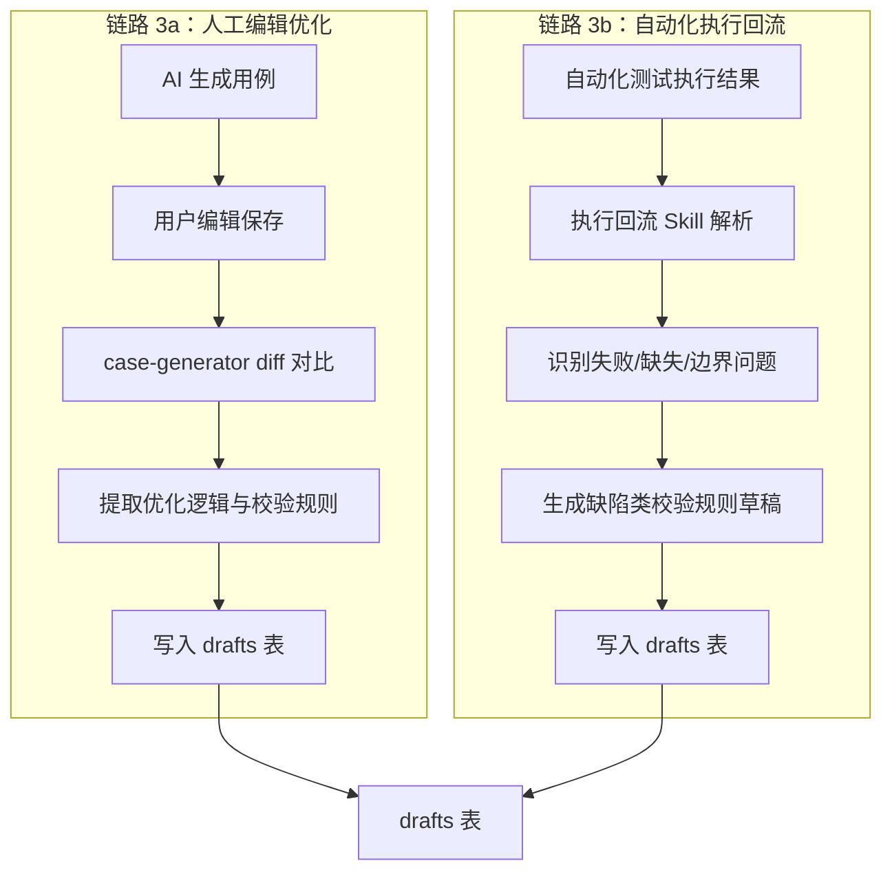
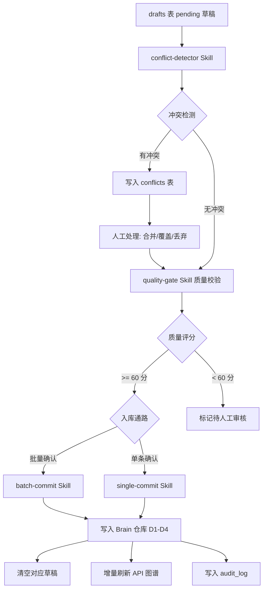
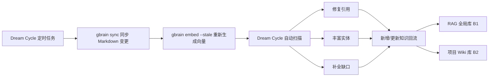

# 知识管理系统 V1.0 架构设计与详细技术方案

> 第一个里程碑版本：个人完整业务流。基于 GBrain 内核，单人跑通 AI 测试用例自动生成系统知识闭环 PRD 的完整流程。

---

## 1. 版本目标与范围

### 1.1 版本目标

单人完整跑通 PRD 定义的知识闭环：**生成 → 优化 → 沉淀 → 再生成**。

**系统定位**：本系统是知识管理引擎，不重建 AI harness。用例生成、校验等推理任务由外部 AI 智能体平台（CodeBuddy/WorkBuddy/Coze）的 harness 编排，本系统仅通过 MCP 接口提供知识查询/写入能力。

### 1.2 范围界定

| 范围 | 包含 | 不包含 |
|------|------|--------|
| 用户规模 | 单人使用 | 多用户协同 |
| 权限 | 无权限分级 | 读写权限管理 |
| 安全 | 无涉密管控 | 涉密分级、网络隔离、SSO |
| 性能 | PGLite 嵌入式 | 向量数据库迁移、图数据库 |
| 运行时 | Python 3.10+ | 评估是否需要切换 |
| Web UI | 基础 Web UI（功能完整，样式简陋） | React/Vue SPA、cookie/会话/交互体验优化 |
| LLM | GBrain 内核所需（向量嵌入/分块），非大模型调用 | 大模型调用由 AI 平台负责 |
| **AI harness** | **不重建，复用外部 AI 平台** | **工具调用、对话编排、上下文管理** |
| **Web UI** | **仅管理（浏览/编辑/审核/冲突/图谱/推理验证）** | **日常知识消费、多轮对话** |
| **业务前端** | **REST API 接收源数据 + 用户确认** | **AI 推理** |

### 1.3 PRD 需求覆盖清单

| PRD 需求 | V1.0 实现方式 | 状态 |
|---------|-------------|------|
| 四层架构（输入源/加工/缓冲/存储） | GBrain 内核 + L2 缓冲层 + Brain 仓库 | ✅ |
| 双通路知识入库（批量+单条） | batch-commit / single-commit Skill | ✅ |
| 本地持久缓存（重启不丢） | SQLite（Python sqlite3） | ✅ |
| 缓存分层缓冲 | L2 缓冲层设计 | ✅ |
| 读写严格隔离 | MCP 查询接口只读+写缓存，MCP 写入接口只读+写正式库 | ✅ |
| API 依赖图谱动态自更新 | tfidf-code-slicer + api-graph-builder Skill | ✅ |
| 规则冲突检测（合并/覆盖/丢弃） | conflict-detector Skill | ✅ |
| MCP 接口物理隔离（查询+写入） | 双 MCP 实例 | ✅ |
| 知识回流闭环 | Dream Cycle 定时任务 | ✅ |
| 知识沉淀优先级 | quality-gate Skill | ✅ |
| LM Wiki 项目知识库 | Brain 仓库 project-wiki/ 目录 | ✅ |
| RAG 全局知识库 | GBrain RRF 混合搜索 | ✅ |

---

## 2. 技术栈选型

### 2.1 软件系统架构模式

本系统采用 **B/S 架构（Browser/Server）+ 前后端分离** 开发范式，但 Web UI 的定位是**知识库管理界面**而非日常消费界面。系统作为知识管理引擎，有两侧外部对接，**不重建 AI harness**：

- **业务侧**：业务页面通过 REST API 提交"业务意图"（操作类型 + 参数），AI 平台根据操作类型选择预设执行模板
- **AI 平台侧**：AI 智能体平台（CodeBuddy/WorkBuddy/Coze）通过 MCP 协议调用知识系统的知识查询/写入接口，复用平台 harness 能力

**三层 prompt 分离**（核心设计）：

| 层 | 归属 | 内容 | 换 AI 平台时 |
|----|------|------|------------|
| 业务意图 | 业务页面 | 操作类型 + 业务参数 + 业务约束 | 不变 |
| 执行模板 | AI 平台 | 大模型指令 + 工具调用编排 + 输出格式 | 随平台迁移 |
| 知识上下文 | 知识系统 | RRF 检索结果 + 知识图谱查询 + Brain 页面 | 不变 |

**完整链路**：业务页面按钮 → 提交业务意图 → AI 平台选择执行模板 → AI 平台调用知识系统 MCP 获取知识上下文 → AI 平台拼接完整 prompt → AI 平台调用大模型 → AI 平台调用知识系统 MCP 写入草稿 → 结果返回业务页面

**关键原则**：
1. **知识系统不重建 harness**：工具调用链、多轮对话、上下文窗口管理、大模型调用均为 AI 平台职责
2. **业务入口为按钮类确定性操作**：提交业务意图（操作类型 + 参数），不提交完整 prompt
3. **Web UI 仅管理**：浏览、编辑、审核、冲突处理、图谱可视化、验证性推理测试（单次检索，不做多轮对话）
4. **日常知识消费由 AI 平台完成**：用例生成、校验等推理任务由 AI 平台 harness 编排，知识系统仅提供 MCP 接口
5. **换 AI 平台零改动**：业务页面和知识系统都不需要改动，只需在新 AI 平台上重新配置"操作类型 → 执行模板"映射

| 层 | V1.0 | V2.0+ |
|----|------|-------|
| **AI 智能体平台** | 外部 MCP 客户端调用（CodeBuddy/WorkBuddy） | MCP + REST API，复用平台 harness |
| **业务系统前端** | CLI / REST API 提交业务意图 | 内网 Web 服务，REST API 提交业务意图 |
| **Web UI（管理界面）** | 基础 Web UI（功能完整，样式简陋） | UI 优化（cookie/会话/交互体验） |
| **后端 API 网关** | GBrain MCP Server 直接暴露 | 独立 API 网关（路由/鉴权/审计/限流） |
| **缓冲层** | SQLite（Python sqlite3） | Python 标准库 |
| **Skill 层** | Fat Skills（Markdown 定义） | 同 V1.0 |
| **内核** | GBrain 0.42.x（Bun，仅 CLI） | 与自建模块解耦 |
| **GBrain 内核 LLM** | MaaS 平台（向量嵌入/分块，非大模型调用） | 同 V1.0 |
| **数据库** | PGLite 嵌入式 | Supabase → 独立 Postgres |

### 2.2 技术栈总览

| 层 | 技术 | 版本 | 说明 |
|----|------|------|------|
| 内核 | GBrain | v0.16.x | PGLite 嵌入式，零配置 |
| 数据库 | PGLite | 内嵌 | GBrain 自带，无需独立部署 |
| 缓冲层 | SQLite | 3.x | 使用 Python sqlite3 标准库 |
| TF-IDF 切片 | Python | 3.10+ | 原生 Python 实现 |
| MCP 接口 | GBrain MCP | 内置 | 两个独立 gbrain serve 实例 |
| GBrain 内核 LLM | MaaS 平台 | - | 向量嵌入/分块（非大模型调用），OpenAI 兼容接口 |
| 运行时 | Python | 3.10+ | 全链路 Python 实现 |
| 包管理 | pip / uv | - | requirements.txt |

### 2.2 运行时兼容性设计

V1.0 全链路使用 Python 3.10+ 实现，GBrain 内核仍使用 Bun 运行时（仅用于 GBrain CLI 调用）。自建模块与 GBrain 内核解耦，通过子进程调用 `gbrain` CLI。

#### 2.2.1 兼容策略

| 层面 | 技术 | 说明 |
|------|------|------|
| 自建模块 | Python 3.10+ | REST API、MCP 服务器、缓冲层、Skills 全部用 Python |
| 包管理 | pip / uv | `requirements.txt` 管理依赖 |
| SQLite | Python sqlite3 | 标准库，无需额外编译 |
| TF-IDF 脚本 | Python | 原生 Python 实现 |
| Skill 定义 | Markdown 文件 | 与运行时无关 |
| MCP 配置 | Python mcp SDK | 标准 MCP 协议实现 |
| GBrain CLI | Bun 运行时 | 仅调用 `gbrain` 命令，不修改内核 |

#### 2.2.2 依赖清单

- [ ] Python 3.10+ 已安装
- [ ] `pip install -r requirements.txt` 成功
- [ ] `gbrain` CLI 全局可用
- [ ] `pytest` 测试通过

### 2.3 GBrain 内核 LLM 配置（非大模型调用）

**重要区分**：本节的 LLM 配置是 GBrain 内核自身运行所需的（向量嵌入、智能分块），**不是**知识系统调用大模型生成用例。大模型调用（用例生成、用例校验等推理任务）由 AI 智能体平台的 harness 负责，知识系统不配置大模型。

GBrain 内核需要 LLM 做两件事：
1. **向量嵌入**：将 Markdown 页面转为向量，支撑 RRF 混合搜索
2. **智能分块**：对高价值内容做语义分块（递归分块和关键词搜索不需要 LLM）

```bash
# 环境变量配置（仅 GBrain 内核使用，非大模型调用）
export OPENAI_API_KEY="<MaaS 平台 API Key>"
export OPENAI_BASE_URL="https://maas.icompify.com:32788/v1"
# 不配置 ANTHROPIC_API_KEY（多查询扩展由 AI 平台 harness 负责，不在知识系统内）
```

| 功能 | 需要 LLM | 模型/方式 | 接口 | 降级方案 |
|------|---------|---------|------|---------|
| 向量嵌入 | 是 | MaaS embedding 模型 | /v1/embeddings | 关键词检索（GBrain 原生） |
| 智能分块 | 是 | Qwen / DeepSeek | /v1/chat/completions | 递归分块（GBrain 默认） |
| 知识图谱连线 | 否 | 正则规则引擎 | — | 零 Token 成本 |
| Minions 任务 | 否 | Postgres 原生 | — | 零 Token 成本 |
| 冲突检测 | 否 | 规则引擎 | — | 零 Token 成本 |
| 质量门控 | 否 | 规则引擎 | — | 零 Token 成本 |
| 用例生成 | **不在本系统** | AI 平台大模型 | AI 平台 harness | — |
| 用例校验 | **不在本系统** | AI 平台大模型 | AI 平台 harness | — |
| 多查询扩展 | **不在本系统** | AI 平台大模型 | AI 平台 harness | — |

**降级方案**：

| 场景 | 降级策略 |
|------|---------|
| MaaS 不提供 /v1/embeddings | V1.0 先用关键词检索（GBrain 原生支持），V2.0 再接向量 |
| MaaS 不提供 /v1/chat/completions | 跳过智能分块，使用递归分块（GBrain 默认策略） |
| 无 LLM 可用 | GBrain 内核退化为纯关键词检索 + 递归分块，知识图谱连线 + Minions 任务 + 冲突检测 + 质量门控均正常工作（零 LLM 依赖） |

---

## 3. 系统目录结构设计

```
test-knowledge-system/
├── brain/                              # GBrain Brain Repository（Git 管理）
│   ├── quality-rules/                  # D1 质量规则知识库
│   │   ├── .brain/                     # GBrain 元数据（索引、向量、图谱）
│   │   └── *.md                        # 规则页面（Compiled Truth + Timeline）
│   ├── defect-experience/              # D2 缺陷经验库
│   │   ├── .brain/
│   │   └── *.md                        # 缺陷页面（frontmatter: 类型/级别/关联用例）
│   ├── project-wiki/                   # D3 LM Wiki 项目知识库
│   │   ├── .brain/
│   │   └── *.md                        # 业务流程/状态机/需求约束
│   └── test-cases/                     # D4 历史测试用例库
│       ├── .brain/
│       └── *.md                        # 用例页面（frontmatter: ID/状态/关联规则）
│
├── skills/                             # 自定义 Fat Skills（8 个）
│   ├── tfidf-code-slicer.md            # 代码 TF-IDF 切片
│   ├── case-generator.md               # 知识查询接口（供 AI 平台调用）
│   ├── case-validator.md               # 知识校验接口（供 AI 平台调用）
│   ├── conflict-detector.md            # 规则冲突检测
│   ├── batch-commit.md                 # 批量入库
│   ├── single-commit.md                # 单条入库
│   ├── api-graph-builder.md            # API 依赖图谱构建
│   └── quality-gate.md                 # 质量门控
│
├── cache/                              # L2 本地持久缓存
│   ├── drafts.db                       # SQLite 待入库草稿（Python sqlite3）
│   └── conflict-queue.db               # SQLite 冲突待处理队列
│
├── agents/                             # MCP 接口配置（供 AI 平台调用）
│   ├── generator.json                  # 生成接口 MCP 配置（知识查询 + 草稿写入）
│   └── validator.json                  # 校验接口 MCP 配置（知识查询 + 草稿读写 + 正式库写入）
│
├── api/                                # REST API 网关（供业务前端 + Web UI 调用）
│   ├── routes/                         # 路由定义
│   ├── middleware/                     # 鉴权、审计、限流中间件
│   └── handlers/                       # 请求处理器
│
├── web/                                # Web UI 管理界面（V1.0 基础版，V2.0 优化）
│   ├── src/                            # 前端源码（V1.0 基础 HTML/JS，V2.0 React/Vue）
│   └── public/                         # 静态资源
│
├── config/                             # 系统配置
│   ├── gbrain.config.ts                # GBrain 配置（LLM、数据库、Skills 白名单）
│   └── skills.config.ts                # Skills 注册与路由配置
│
├── scripts/                            # 运维脚本（Python / Shell）
│   ├── init-brain.sh                   # 初始化 Brain 仓库
│   ├── start-agents.sh                 # 启动 MCP 接口服务
│   ├── dream-cycle-cron.sh             # Dream Cycle 定时任务
│   └── tfidf-slicer.py                 # TF-IDF 代码切片脚本（Python）
│
├── requirements.txt                    # Python 依赖声明
├── package.json                        # 保留（engines 声明，GBrain CLI 使用）
└── .env.example                        # 环境变量模板
```

### 3.1 目录设计说明

| 目录 | 用途 | 运行时兼容 |
|------|------|-----------|
| `brain/` | GBrain Brain 仓库，Git 管理 | 与运行时无关 |
| `skills/` | Fat Skills 定义，Markdown 文件 | 与运行时无关 |
| `cache/` | SQLite 缓冲层 | Python sqlite3 标准库 |
| `agents/` | MCP 实例配置，JSON 文件 | 标准 JSON-RPC |
| `config/` | Python 配置文件 | Python 3.10+ |
| `scripts/` | 运维脚本 | Python / Shell |

---

## 4. 四个知识库的 Brain 仓库设计（单仓库分目录）

### 4.1 单仓库分目录方案

采用**单 Brain 仓库分目录**方案，四个知识库在同一个 Brain 仓库内用目录区分。

**优势**：
- 跨库检索无需切换仓库
- Dream Cycle 统一维护
- 知识图谱跨库关联自然建立
- 管理简单，一个 `gbrain sync` 同步所有知识

### 4.2 各知识库目录结构

#### D1 质量规则库（`brain/quality-rules/`）

```
brain/quality-rules/
├── .brain/                    # GBrain 元数据
├── coding-standards.md        # 编码规范规则
├── naming-conventions.md      # 命名规范规则
├── review-checklist.md        # 代码审查检查项
└── entry-exit-rules.md        # 准入准出规则
```

页面结构（Compiled Truth + Timeline）：
```markdown
---
type: quality-rule
rule_id: QR-001
category: coding-standards
status: active
created: 2026-07-15
updated: 2026-07-15
---

# 编码规范：函数命名使用 camelCase

## Compiled Truth（当前最佳理解）

函数命名统一使用 camelCase 格式，首字母小写。常量使用 UPPER_SNAKE_CASE。

## Timeline（历史证据，只追加）

- 2026-07-15: 初始创建，来源于编码规范文档 V3.2
```

#### D2 缺陷经验库（`brain/defect-experience/`）

```
brain/defect-experience/
├── .brain/
├── null-pointer-2026-07-01.md
├── boundary-overflow-2026-07-10.md
└── api-timeout-2026-07-12.md
```

页面结构：
```markdown
---
type: defect
defect_id: DEF-001
defect_type: null-pointer
severity: high
related_cases: [TC-001, TC-045]
created: 2026-07-01
---

# 空指针异常：用户服务 getUserById 方法

## Compiled Truth

调用 getUserById 时未校验入参 userId 是否为 null，导致 NPE。

## Timeline

- 2026-07-01: 缺陷发现，JIRA TICKET-001
- 2026-07-03: 修复并补充校验规则 QR-045
```

#### D3 项目 Wiki 库（`brain/project-wiki/`）

```
brain/project-wiki/
├── .brain/
├── user-service-flow.md       # 用户服务业务流程
├── order-state-machine.md     # 订单状态机
├── api-contracts.md           # API 契约约束
└── scenario-specs.md          # 自定义场景规范
```

#### D4 历史测试用例库（`brain/test-cases/`）

```
brain/test-cases/
├── .brain/
├── TC-001-user-login.md
├── TC-002-user-logout.md
└── TC-003-order-create.md
```

页面结构：
```markdown
---
type: test-case
case_id: TC-001
status: active
related_rules: [QR-001, QR-012]
api_dependencies: [userService.login, authService.validate]
created: 2026-07-15
updated: 2026-07-15
---

# 测试用例：用户登录

## Compiled Truth

正向用例：使用有效账号密码登录，验证返回 token 和用户信息。

## Timeline

- 2026-07-15: 初始创建
- 2026-07-16: 补充边界场景（密码为空、账号锁定）
```

---

## 5. L2 缓冲层设计

### 5.1 缓冲层定位

GBrain 原生的 `import → embed → sync` 是单向流，没有"待入库草稿"中间态。L2 缓冲层在 GBrain 内核前增加一层 SQLite 缓存，承接人工编辑优化和自动化执行回流产生的增量知识草稿，经冲突检测和质量门控后，再通过双通路写入 GBrain 正式知识库。

### 5.2 SQLite 表结构

使用 Python 标准库 `sqlite3`，无需额外依赖，重启不丢失数据。

#### drafts 表（待入库草稿）

```sql
CREATE TABLE IF NOT EXISTS drafts (
    id          TEXT PRIMARY KEY,           -- UUID
    source      TEXT NOT NULL,              -- 草稿来源：human_edit / execution_feedback
    type        TEXT NOT NULL,              -- 草稿类型：quality_rule / defect_experience / test_case
    title       TEXT NOT NULL,              -- 草稿标题
    content     TEXT NOT NULL,              -- 草稿正文（Markdown）
    metadata    TEXT,                       -- JSON 元数据（关联用例、缺陷类型等）
    status      TEXT DEFAULT 'pending',     -- pending / conflict / merged / discarded
    created_at  TEXT DEFAULT (datetime('now')),
    updated_at  TEXT DEFAULT (datetime('now'))
);

CREATE INDEX IF NOT EXISTS idx_drafts_status ON drafts(status);
CREATE INDEX IF NOT EXISTS idx_drafts_type ON drafts(type);
CREATE INDEX IF NOT EXISTS idx_drafts_source ON drafts(source);
```

#### conflicts 表（冲突待处理队列）

```sql
CREATE TABLE IF NOT EXISTS conflicts (
    id              TEXT PRIMARY KEY,        -- UUID
    draft_id        TEXT NOT NULL,           -- 关联草稿 ID
    existing_rule   TEXT NOT NULL,           -- 冲突的已有规则内容
    new_rule        TEXT NOT NULL,           -- 冲突的新规则内容
    conflict_type   TEXT NOT NULL,           -- duplicate / contradiction / overlap
    resolution      TEXT,                    -- merge / overwrite / discard（人工处理结果）
    resolved_by     TEXT,                    -- 处理人
    resolved_at     TEXT,
    created_at      TEXT DEFAULT (datetime('now')),
    FOREIGN KEY (draft_id) REFERENCES drafts(id)
);

CREATE INDEX IF NOT EXISTS idx_conflicts_draft ON conflicts(draft_id);
CREATE INDEX IF NOT EXISTS idx_conflicts_resolution ON conflicts(resolution);
```

#### audit_log 表（操作日志）

```sql
CREATE TABLE IF NOT EXISTS audit_log (
    id          TEXT PRIMARY KEY,            -- UUID
    action      TEXT NOT NULL,               -- generate / edit / commit / conflict_detect / quality_check
    operator    TEXT NOT NULL,               -- agent_id / user_id
    target      TEXT,                        -- 操作对象（草稿 ID / 规则 ID / 用例 ID）
    detail      TEXT,                        -- JSON 详情
    created_at  TEXT DEFAULT (datetime('now'))
);

CREATE INDEX IF NOT EXISTS idx_audit_action ON audit_log(action);
CREATE INDEX IF NOT EXISTS idx_audit_created ON audit_log(created_at);
```

### 5.3 草稿生成两条链路

#### 链路 1：人工编辑优化

```
AI 生成用例 → 用户编辑保存 → case-generator Skill diff 对比
→ 提取优化逻辑与校验规则 → 生成人工优化类规则草稿
→ 写入 drafts 表（source = 'human_edit'）
```

#### 链路 2：自动化执行回流

```
自动化测试执行结果回传 → 执行回流 Skill 解析失败场景
→ 生成缺陷类校验规则草稿
→ 写入 drafts 表（source = 'execution_feedback'）
```

### 5.4 入库双通路

#### 主通路：批量确认入库（batch-commit Skill）

```
读取全量 drafts（status = 'pending'）
→ conflict-detector Skill 批量对比 quality-rules 库
→ 标记冲突（status = 'conflict'，写入 conflicts 表）
→ 人工处理冲突（merge / overwrite / discard）
→ quality-gate Skill 质量校验
→ 写入 GBrain Brain 仓库（quality-rules / defect-experience / project-wiki / test-cases）
→ api-graph-builder Skill 增量刷新 API 依赖图谱
→ 清空已入库草稿（status = 'merged'）
→ 写入 audit_log
```

#### 兜底通路：单条确认同步提交（single-commit Skill）

```
读取单条 draft（status = 'pending'）
→ conflict-detector Skill 单条对比
→ quality-gate Skill 单条校验
→ 写入 GBrain Brain 仓库
→ api-graph-builder Skill 增量刷新
→ 清除对应草稿
→ 写入 audit_log
```

### 5.5 缓冲规则约束

| 约束 | 实现 |
|------|------|
| 缓存为本地持久缓存，重启不丢失 | SQLite 文件存储（Python sqlite3） |
| 仅入库成功后清除对应草稿 | batch-commit 清全部，single-commit 清单条 |
| 无编辑直接确认不产生草稿 | case-generator Skill 检测 diff，无改动则不写入 drafts |
| 冲突必须前置检测 | 入库前强制调用 conflict-detector Skill |

---

## 6. API 依赖图谱设计

### 6.1 设计思路

GBrain 原生知识图谱是实体关系（人/公司/概念），非 API 调用关系。通过自建 `tfidf-code-slicer` Skill 扩展实体类型，将 API 接口、方法、调用关系建模为 GBrain 知识图谱实体。

### 6.2 实体类型扩展

| 实体类型 | GBrain 关系类型 | 说明 |
|---------|-----------------|------|
| API 接口 | `works_at`（API 属于模块） | 每个 API 作为一个实体页面 |
| 方法调用 | `attended`（方法调用 API） | 方法调用关系 |
| 模块 | `founded`（模块包含 API） | 模块作为容器实体 |
| 依赖关系 | `advises`（API 依赖另一个 API） | 前置/后置依赖 |

### 6.3 tfidf-code-slicer Skill

```markdown
# tfidf-code-slicer

## 触发条件
业务代码更新后，由 api-graph-builder Skill 调用。

## 输入
- 代码文件路径（支持 .py / .js / .ts / .java）

## 处理流程
1. Python 脚本（tfidf-slicer.py）解析代码文件
2. 提取接口定义（函数签名、参数、返回值）
3. 提取方法调用关系（AST 分析）
4. TF-IDF 计算接口相似度
5. 输出结构化 JSON（接口列表 + 调用关系图）

## 输出
```json
{
  "interfaces": [
    {"id": "userService.login", "module": "UserService", "params": ["username", "password"], "returns": "Token"},
    {"id": "authService.validate", "module": "AuthService", "params": ["token"], "returns": "boolean"}
  ],
  "dependencies": [
    {"from": "userService.login", "to": "authService.validate", "type": "precondition"}
  ]
}
```

## 调用方式
- 全量更新：代码变更触发，全量重构 API 依赖图谱
- 增量更新：知识库变更触发 Dream Cycle，增量修正依赖关系
```

### 6.4 api-graph-builder Skill

```markdown
# api-graph-builder

## 触发条件
1. 代码变更 → tfidf-code-slicer 输出 → 全量重构
2. 知识库变更 → Dream Cycle → 增量更新

## 处理流程
1. 读取 tfidf-code-slicer 输出的 JSON
2. 为每个 API 接口创建/更新 GBrain 实体页面
3. 建立实体间关联（works_at / attended / founded / advises）
4. 更新 project-wiki 目录下的 API 契约文档

## 约束
- 无人工编辑入口，完全后台数据驱动
- 全量重构时不删除已有关联，仅追加修正
- 增量更新仅修正前置/后置依赖逻辑
```

---

## 7. MCP 接口设计

### 7.0 设计定位

本系统的两个 MCP 接口（知识查询 / 知识写入）**不是 AI 智能体**，而是知识系统的接口服务。AI 平台 harness 负责工具调用编排、大模型调用、多轮对话，知识系统仅通过 MCP 协议暴露知识查询/写入接口。

**三层 prompt 分离设计**：

| 层 | 归属 | 内容 | 示例 |
|----|------|------|------|
| 业务意图 | 业务页面 | 操作类型 + 业务参数 + 业务约束 | `操作=生成用例, PRD=xxx.md, 代码=src/` |
| 执行模板 | AI 平台 | 大模型指令 + 工具调用编排 + 输出格式 | `你是测试用例生成专家，先查询质量规则库，再查询API图谱，然后生成用例...` |
| 知识上下文 | 知识系统 | RRF 检索结果 + 知识图谱查询 + Brain 页面 | 通过 MCP 接口按需返回 |

**完整链路**：业务页面按钮 → 提交业务意图 → AI 平台选择执行模板 → AI 平台调用知识系统 MCP 获取知识上下文 → AI 平台拼接完整 prompt（执行模板 + 知识上下文 + 业务参数）→ AI 平台调用大模型 → AI 平台调用知识系统 MCP 写入草稿 → 结果返回业务页面

| 维度 | 本系统职责 | AI 智能体平台职责 |
|------|-----------|-----------------|
| 知识查询 | MCP 接口暴露 RRF 搜索、知识图谱查询、Brain 页面读取 | 调用 MCP 接口获取知识上下文 |
| 知识写入 | MCP 接口暴露草稿写入、正式入库、API 图谱更新 | 调用 MCP 接口写入知识 |
| 业务意图 | 接收业务页面的操作类型 + 参数 | 不涉及 |
| 执行模板 | 不涉及 | 根据操作类型选择预设执行模板 |
| prompt 拼接 | 不涉及 | 拼接执行模板 + 知识上下文 + 业务参数 |
| 大模型调用 | 不涉及 | harness 调用大模型 |
| 用例生成 | 不涉及 | harness 编排工具调用链，生成测试用例 |
| 用例校验 | 不涉及 | harness 编排校验逻辑，输出校验报告 |
| 对话编排 | 不涉及 | harness 管理多轮对话和上下文窗口 |

### 7.1 MCP 接口 1：知识查询接口（供 AI 平台生成用例时调用）

```json
// agents/generator.json
{
  "name": "case-generator",
  "brain_repo": "./brain",
  "mode": "mcp",
  "skills_whitelist": [
    "case-generator",
    "tfidf-code-slicer",
    "api-graph-builder"
  ],
  "permissions": {
    "brain": "read-only",
    "cache": "write",
    "formal_kb": "deny"
  },
  "description": "知识查询接口：只读知识库，返回知识检索结果，接收草稿写入"
}
```

**实际调用方式**：AI 智能体平台（如 CodeBuddy）通过 MCP 协议调用本系统的知识查询接口，获取全量存量知识后，由平台 harness 编排生成逻辑。本系统的 MCP 接口是接口服务，不是 AI 推理引擎。

**职责**：
- 读取全量存量知识（RAG 全局库 + 项目 Wiki + API 图谱 + 历史用例 + 质量规则）
- 输出测试点与测试用例
- 检测人工编辑 diff，生成优化类规则草稿，写入 drafts 表

**权限边界**：
- Brain 仓库：只读
- SQLite 缓存：写入（仅 drafts 表）
- 正式知识库：禁止写入

### 7.2 MCP 接口 2：知识写入接口（供 AI 平台入库时调用）

```json
// agents/validator.json
{
  "name": "case-validator",
  "brain_repo": "./brain",
  "mode": "mcp",
  "skills_whitelist": [
    "case-validator",
    "conflict-detector",
    "batch-commit",
    "single-commit",
    "quality-gate"
  ],
  "permissions": {
    "brain": "read-only",
    "cache": "read-write",
    "formal_kb": "write"
  },
  "description": "知识校验接口：只读知识库，读取草稿，冲突检测，写入正式库"
}
```

**实际调用方式**：AI 智能体平台通过 MCP 协议调用本系统的校验接口，获取质量规则和 API 图谱后，由平台 harness 编排校验逻辑。本系统的 MCP 接口是接口服务，不是 AI 推理引擎。

**职责**（MCP 接口能力）：
- 独立校验用例合规性、完整性、逻辑性
- 读取 drafts 表待入库草稿
- 执行冲突检测、质量门控
- 通过双通路写入正式知识库
- 增量刷新 API 依赖图谱

**权限边界**：
- Brain 仓库：只读（校验时参考）
- SQLite 缓存：读写（drafts + conflicts + audit_log）
- 正式知识库：写入（通过 gbrain import / gbrain embed）

### 7.3 MCP 接口部署

两个 MCP 接口使用独立的 `gbrain serve` 实例，各自独立的端口和 Skills 白名单：

```bash
# 启动 MCP 接口 1：知识查询（供 AI 平台生成用例时调用）
gbrain serve --port 8100 --config agents/generator.json

# 启动 MCP 接口 2：知识写入（供 AI 平台入库时调用）
gbrain serve --port 8101 --config agents/validator.json
```

> 注：这两个 MCP 接口不是 AI 智能体，而是知识系统的接口服务。AI 平台 harness 负责工具调用编排、大模型调用、多轮对话，知识系统仅通过 MCP 接口提供知识查询/写入能力。

### 7.4 UML 类图 — 模块调用关系与函数调用关系

下图展示 V1.0 各层模块的类定义、核心方法、权限边界及跨层调用关系：

> UML 类图 SVG 文件：[uml-class-diagram.svg](./images/uml-class-diagram.svg)（注：SVG 为初版架构，最新内容以下方 mermaid 图为准）




**调用关系说明**：

| 调用方 → 被调用方 | 调用类型 | 说明 |
|-------------------|---------|------|
| 业务页面 → AI 平台 | REST API | 提交业务意图（操作类型 + 参数） |
| AI 平台 → MCP 接口 | MCP 协议 | 知识查询/写入（AI 平台 harness 编排） |
| 业务页面 → REST API | REST API | 源数据上传/用户确认操作（不经过 AI 平台） |
| Web UI → REST API | REST API | 管理操作（浏览/编辑/审核/冲突） |
| MCP 接口 → SearchEngine | 只读 | RRF 混合搜索 |
| MCP 接口 → KnowledgeGraph | 只读 | 知识图谱查询 |
| MCP 接口 → BrainRepository | 只读 | Brain 页面读取 |
| MCP 接口 → DraftCache | 读写 | 草稿写入/读取 |
| REST API → DraftCache | 读写 | 用户确认/冲突处理 |
| REST API → ConflictQueue | 读写 | 冲突读取/处理 |
| TfidfCodeSlicer → ApiGraphBuilder | 执行 | 代码切片输出传递给图谱构建 |
| ApiGraphBuilder → KnowledgeGraph | 写入 | 更新 API 依赖图谱 |
| ApiGraphBuilder → BrainRepository | 写入 | 更新 project-wiki 目录 |
| ConflictDetector → SearchEngine | 只读 | 检索相似规则进行冲突比对 |
| ConflictDetector → DraftCache | 读写 | 读取草稿、标记冲突 |
| ConflictDetector → ConflictQueue | 读写 | 写入冲突队列 |
| QualityGate → DraftCache | 读写 | 读取草稿、标记质量评分 |
| BatchCommit → BrainRepository | 写入 | 批量写入正式知识库 |
| BatchCommit → DraftCache | 读写 | 清空已入库草稿 |
| BatchCommit → AuditLog | 写入 | 记录入库操作日志 |
| SingleCommit → BrainRepository | 写入 | 单条写入正式知识库 |
| SingleCommit → DraftCache | 读写 | 清除对应草稿 |
| SingleCommit → AuditLog | 写入 | 记录入库操作日志 |
| DreamCycle → BrainRepository | 读写 | 同步 Markdown、重新生成向量 |
| DreamCycle → SearchEngine | 读写 | 修复引用、丰富实体 |
| DreamCycle → KnowledgeGraph | 读写 | 补全缺失实体、更新关联 |

**权限边界**：

| 接口 / Skill | Brain 仓库 | SQLite 缓冲层 | 正式知识库 |
|-------------|-----------|---------------|-----------|
| MCP 接口（供 AI 平台） | 只读 + 草稿写入 | 读写（drafts） | 禁止直接写入 |
| REST API（供业务前端） | 只读 | 读写（drafts + conflicts + audit_log） | 通过 Skill 写入 |
| TfidfCodeSlicer | 禁止 | 禁止 | 禁止 |
| ApiGraphBuilder | 写入（project-wiki） | 禁止 | 写入 |
| ConflictDetector | 只读 | 读写 | 禁止 |
| QualityGate | 只读 | 读写 | 禁止 |
| BatchCommit | 写入 | 读写 | 写入 |
| SingleCommit | 写入 | 读写 | 写入 |
| DreamCycle | 读写 | 禁止 | 读写 |

---

## 8. 知识流转全链路设计

### 8.0 全链路总览



### 8.1 链路 1：API 依赖图谱动态更新（后台自动）



**触发条件**：业务代码更新 / 知识库业务数据变更
**调用序列**：`tfidf-code-slicer` → `api-graph-builder` → `gbrain embed --stale`
**数据流向**：A2/D3/D4 → B3（API 依赖图谱）

### 8.2 链路 2：AI 用例只读生成



**触发条件**：用户触发生成操作
**数据流向**：A1-A5 + B1-B3 + D1-D4 → B4（AI 平台 harness 编排）

### 8.3 链路 3：临时草稿生成



**数据流向**：B4/A5 → C（SQLite drafts 表）

### 8.4 链路 4：正式知识库入库（双通路）



**主通路**：`conflict-detector` → `batch-commit` → `api-graph-builder`
**兜底通路**：`conflict-detector` → `single-commit` → `api-graph-builder`
**数据流向**：C → D1/D2/D3/D4 → B3

### 8.5 链路 5：知识回流闭环



**触发条件**：Dream Cycle 定时任务（每日凌晨）
**数据流向**：D1/D2/D3/D4 → B1/B2

---

## 9. 关键 Skill 定义

### 9.0 Skill 定位说明

本系统的 Skill 是知识管理操作（冲突检测、入库、质量门控等），**不是 AI 推理 Skill**。涉及 LLM 调用的操作（用例生成、用例校验）由外部 AI 智能体平台的 harness 编排，本系统仅通过 MCP 接口提供知识查询/写入能力。

| Skill 类型 | 本系统 Skill | AI 智能体平台 harness |
|-----------|-------------|---------------------|
| 知识查询 | MCP 接口暴露 RRF 搜索、图谱查询、Brain 页面读取 | 调用 MCP 接口获取知识 |
| 知识写入 | MCP 接口暴露草稿写入、正式入库、图谱更新 | 调用 MCP 接口写入知识 |
| 冲突检测 | conflict-detector Skill（规则引擎，无 LLM） | — |
| 质量门控 | quality-gate Skill（规则引擎，无 LLM） | — |
| 入库操作 | batch-commit / single-commit Skill（确定性操作，无 LLM） | — |
| 用例生成 | — | harness 编排工具调用链，调用本系统 MCP 接口获取知识 |
| 用例校验 | — | harness 编排校验逻辑，调用本系统 MCP 接口获取规则 |
| 多轮对话 | — | harness 管理上下文窗口和对话状态 |

### 9.1 Fat Skills 清单

| Skill 名称 | 触发方式 | 输入 | 输出 | LLM 依赖 | 说明 |
|------------|---------|------|------|---------|------|
| tfidf-code-slicer | api-graph-builder 调用 | 代码文件路径 | JSON（接口+依赖） | 无（Python 脚本） | 确定性操作 |
| case-generator | AI 平台 MCP 调用 | 全量存量知识 | 知识检索结果 | 无 | 仅提供知识查询，生成逻辑由 AI 平台 harness 编排 |
| case-validator | AI 平台 MCP 调用 | 质量规则 + API 图谱 | 知识检索结果 | 无 | 仅提供知识查询，校验逻辑由 AI 平台 harness 编排 |
| conflict-detector | 入库前强制调用 | 待入库草稿 + 质量规则库 | 冲突列表 | 否（规则引擎） | 确定性操作 |
| batch-commit | 用户批量确认 | 全量 pending 草稿 | 入库结果 | 否（确定性操作） | 确定性操作 |
| single-commit | 用户单条确认 | 单条草稿 | 入库结果 | 否（确定性操作） | 确定性操作 |
| api-graph-builder | 代码变更 / Dream Cycle | tfidf-code-slicer 输出 | 图谱更新结果 | 否（确定性操作） | 确定性操作 |
| quality-gate | 入库前强制调用 | 待入库草稿 | 质量评分 + 通过/拒绝 | 否（规则引擎） | 确定性操作 |

### 9.2 conflict-detector Skill 详细定义

```markdown
# conflict-detector

## 触发条件
入库前强制调用（batch-commit / single-commit 内部调用）。

## 输入
- 待入库草稿列表（从 drafts 表读取）
- 质量规则库快照（从 brain/quality-rules/ 读取）

## 处理流程
1. 对每条草稿，提取规则关键词与适用范围
2. 在质量规则库中检索相似规则（RRF 混合搜索）
3. 判断冲突类型：
   - duplicate：内容高度相似（余弦相似度 > 0.85）
   - contradiction：内容相互矛盾
   - overlap：适用范围重叠
4. 标记冲突并写入 conflicts 表
5. 返回冲突列表供人工处理

## 冲突处理方式
- merge：合并新旧规则，保留两者精华
- overwrite：新规则覆盖旧规则
- discard：丢弃新规则

## 约束
- 所有入库动作必须前置冲突检测
- 冲突未处理的草稿不得入库
- 冲突检测结果写入 audit_log
```

### 9.3 quality-gate Skill 详细定义

```markdown
# quality-gate

## 触发条件
入库前强制调用（batch-commit / single-commit 内部调用，在 conflict-detector 之后）。

## 输入
- 通过冲突检测的草稿列表

## 处理流程
1. 校验草稿完整性（必填字段：type、title、content、metadata）
2. 校验内容质量（最小长度、格式规范）
3. 校验来源可信度（human_edit 优先级 > execution_feedback）
4. 输出质量评分（0-100）和通过/拒绝决定

## 沉淀优先级规则
- 可用性优先于数量
- 只沉淀人工校验、执行验证过的有效规则
- 杜绝无效海量垃圾知识堆积
- 评分 < 60 的草稿自动标记为"待人工审核"

## 约束
- 质量门控不可跳过
- 拒绝的草稿保留在 drafts 表，status 改为 'rejected'
- 质量评分写入 audit_log
```

---

## 10. 部署方案

### 10.1 环境要求

| 组件 | 要求 |
|------|------|
| 操作系统 | Linux / macOS / Windows（WSL2 推荐） |
| Python | >= 3.10 |
| Python | >= 3.10（TF-IDF 脚本） |
| Git | >= 2.30 |
| 磁盘 | >= 2GB（GBrain + 缓存 + 日志） |
| 网络 | 可访问 MaaS 平台（maas.icompify.com:32788） |

### 10.2 初始化步骤

```bash
# 1. 克隆 GBrain
git clone https://github.com/garrytan/gbrain.git ~/gbrain
cd ~/gbrain
curl -fsSL https://bun.sh/install | bash
export PATH="$HOME/.bun/bin:$PATH"
bun install && bun link

# 2. 配置环境变量
cp .env.example .env
# 编辑 .env：设置 OPENAI_API_KEY、OPENAI_BASE_URL 指向 MaaS 平台

# 3. 初始化 Brain 仓库
./scripts/init-brain.sh
# 创建 brain/ 目录结构，初始化 Git，运行 gbrain init

# 4. 导入存量知识
gbrain import ./brain/quality-rules/ --no-embed
gbrain import ./brain/defect-experience/ --no-embed
gbrain import ./brain/project-wiki/ --no-embed
gbrain import ./brain/test-cases/ --no-embed
gbrain embed --stale

# 5. 初始化缓冲层
# 自动创建 cache/drafts.db 和 cache/conflict-queue.db

# 6. 启动 MCP 接口服务
./scripts/start-agents.sh
# 启动 MCP 接口 1（知识查询，端口 8100）和 MCP 接口 2（知识写入，端口 8101）

# 7. 配置 Dream Cycle 定时任务
./scripts/dream-cycle-cron.sh
# 每日凌晨 2:00 执行 gbrain sync + gbrain embed --stale + Dream Cycle
```

### 10.3 .env 配置模板

```bash
# GBrain 内核 LLM 配置（向量嵌入/分块，非大模型调用）
OPENAI_API_KEY="<MaaS 平台 API Key>"
OPENAI_BASE_URL="https://maas.icompify.com:32788/v1"
# 不配置 ANTHROPIC_API_KEY（多查询扩展由 AI 平台 harness 负责）

# Brain 仓库路径
BRAIN_REPO="./brain"

# 缓冲层配置
CACHE_DB_PATH="./cache/drafts.db"
CONFLICT_DB_PATH="./cache/conflict-queue.db"

# MCP 接口端口
MCP_QUERY_PORT=8100    # 知识查询接口
MCP_WRITE_PORT=8101    # 知识写入接口

# Dream Cycle 定时
DREAM_CYCLE_CRON="0 2 * * *"
```

### 10.4 requirements.txt

```txt
# Python 依赖
flask>=3.0.0
mcp>=1.0.0
python-dotenv>=1.0.0
pytest>=8.0.0
```

### 10.5 package.json（保留用于 GBrain CLI）

```json
{
  "name": "test-knowledge-system",
  "version": "1.0.0",
  "description": "AI 测试用例知识闭环系统 - 基于 GBrain 内核",
  "engines": {
    "bun": ">=1.0"
  },
  "scripts": {
    "init": "bash scripts/init-brain.sh",
    "start": "bash scripts/start-agents.sh",
    "dream": "bash scripts/dream-cycle-cron.sh",
    "test": "pytest"
  }
}
```

---

## 11. V1.0 → V2.0 → V3.0 → V4.0 演进路线

### 11.1 版本演进总览

| 版本 | 里程碑 | 核心交付 | 运行时 | 数据库 |
|------|--------|---------|--------|--------|
| V1.0 | 个人完整业务流 | GBrain 内核 + 缓冲层 + 双通路 + MCP 接口 + TF-IDF | Bun | PGLite |
| V2.0 | 团队内部协同 | 多用户 MCP 网关 + 权限分级 + 审计 + 并发控制 + 质量门控 | Python | Supabase |
| V3.0 | 组件性能优化 | 独立 Postgres + 图数据库 + 多用户读写效率 | Python | 独立 Postgres |
| V4.0 | 企业级跨部门 | 涉密管控 + 网络隔离 + SSO + 安全沙箱 + 强制统一底座 | Python | 独立 Postgres |

### 11.2 V2.0 关键变化

| 维度 | V1.0 | V2.0 |
|------|------|------|
| 用户 | 单人 | 3-5 人团队 |
| 数据库 | PGLite 嵌入式 | Supabase（Pro 版 $25/月，8GB） |
| 权限 | 无 | 读/写/管理三级 |
| 审计 | audit_log 表 | 独立审计组件 + 合规报表 |
| 缓冲层 | SQLite 单文件 | SQLite + 并发锁机制 |
| 质量门控 | 基础规则校验 | 人工审核工单 + 评分体系 |
| Web UI | 基础 Web UI（功能完整，样式简陋） | React/Vue SPA（cookie/会话/交互体验优化） |
| 运行时 | Python 3.10+ | 稳定使用 |

### 11.3 V3.0 关键变化

| 维度 | V2.0 | V3.0 |
|------|------|------|
| 数据库 | Supabase | 独立 Postgres + pgvector |
| 知识图谱 | GBrain 内置 SQLite | 独立图数据库（Neo4j 或 Apache AGE） |
| 检索性能 | RRF 混合搜索 | 优化索引策略 + 缓存层 |
| 图谱计算 | 全量遍历 | 增量计算 + 缓存 |

### 11.4 V4.0 关键变化

| 维度 | V3.0 | V4.0 |
|------|------|------|
| 安全 | 基础权限 | 涉密分级管控 + 水印 + 标签 |
| 网络 | 无隔离 | 高密内网闭环 |
| 认证 | 无 | SSO 集成 |
| 扫描 | 无 | SBOM + 漏洞 + 许可证三重扫描 |
| 底座 | 独立部署 | 强制统一底座（MCP 数据服务 + 安全沙箱 + 混合算力 + 全链路扫描） |

---

## 12. 多项目知识库隔离与共享（V1.0 迭代增强）

### 12.1 背景与动机

V1.0 原始设计面向**单人单项目**场景：所有草稿写入同一张 SQLite 表，四库知识统一落地在 `brain/` 单仓库。随着使用范围扩大，出现两个诉求：

1. **隔离**：不同项目（如 `default`、`demo`）的草稿与知识库需要互不干扰，避免 A 项目的测试用例/质量规则被 B 项目误用。
2. **共享**：部分经验型知识（缺陷经验、通用质量规则）应在多项目间复用，避免重复沉淀。

本增强在**不改变四层架构、双通路、MCP 接口形态**的前提下，引入"项目维度"，实现"**项目私有库隔离 + 共享库复用**"的轻量多租户模型。

### 12.2 设计原则

| 原则 | 说明 |
|------|------|
| 隔离优先 | 默认项目私有库彼此完全隔离，共享库只读复用 |
| 兼容性 | `default` 项目即原 `brain/` 仓库，旧数据与接口零改动 |
| 轻量 | 基于文件系统目录 + SQLite `project_id` 列，不引入新组件 |
| 单一来源 | 每个项目的"私有库 + 共享库"在读取时合并去重，写入只落私有库 |

### 12.3 项目配置（`config/projects.json`）

```json
{
  "defaultProject": "default",
  "sharedBrain": "brains/_shared",
  "categories": ["quality-rules", "defect-experience", "project-wiki", "test-cases"],
  "projects": [
    { "id": "default", "name": "默认项目", "brainPath": "brain" },
    { "id": "demo",    "name": "Demo 项目", "brainPath": "brains/demo" }
  ]
}
```

- `projects[].brainPath`：项目**私有知识库**目录（相对项目根），隔离边界。
- `sharedBrain`：全局**共享知识库**目录，所有项目读取时合并复用，不建议直接写入（由人工/专项任务统一维护）。
- 新增项目只需在 `projects` 数组追加一条并创建对应目录即可，无需改代码。

### 12.4 隔离模型

#### 12.4.1 草稿缓冲层（SQLite）

`cache/drafts.db` 的 `drafts` 表新增 `project_id` 列（默认 `'default'`），并建立索引 `idx_drafts_project`：

```sql
ALTER TABLE drafts ADD COLUMN project_id TEXT DEFAULT 'default';
CREATE INDEX IF NOT EXISTS idx_drafts_project ON drafts(project_id);
```

所有草稿读写均按 `project_id` 过滤：

- 增：`add_draft(draft, project_id='default')`
- 查：`get_drafts_by_status(status, project_id='default')`
- 冲突检测/质量门控：仅作用于指定项目的草稿集合

#### 12.4.2 文件系统知识库（隔离边界）

四个知识库（质量规则 / 缺陷经验 / 项目 Wiki / 历史用例）按项目分目录存放：

```
test-knowledge-system/
├── brain/                     # default 项目私有库（兼容原 brain/ 仓库）
│   ├── quality-rules/  defect-experience/  project-wiki/  test-cases/
├── brains/
│   ├── _shared/               # 共享库（所有项目读取时合并复用）
│   │   ├── quality-rules/  defect-experience/  project-wiki/  test-cases/
│   └── demo/                  # demo 项目私有库（隔离）
│       ├── quality-rules/  defect-experience/  project-wiki/  test-cases/
```

每个目录均放置 `.gitkeep` 以纳入版本管理。

### 12.5 共享机制

读取（浏览 / 搜索 / 图谱 / 冲突检测）时，将**项目私有目录 + 共享目录**合并：

- 文件系统层面：`brainDirsFor(pid) = [resolveBrainDir(pid), resolveSharedDir()]`，按 `category/file` 去重（私有优先）。
- 向量检索层面（RAG）：`case_generator` 的 `_fs_search` 在 `brainDirsFor(pid)` 范围内做关键词打分；后续接 GBrain 向量检索时，`--brain-dirs` 同样传入多目录。
- 冲突检测层面：`conflict_detector._load_existing_fs(pid)` 读取私有 + 共享页面的 `.md` 做标题/正文/指纹比对，确保新草稿与"已有全部可见知识"不冲突。

**写入只落项目私有库**：`single_commit`/`batch_commit` 经 `_resolve_brain_dir(project)` 解析后，仅写入该项目 `brainPath` 对应目录，共享库不会被自动污染。

### 12.6 REST API 项目维度

所有 API 通过 `?project=<id>`（GET）或 `project` 字段（POST body）传递项目维度，由 `api/server.js` 的 `resolveProject(req)` 解析（缺省 `default`）。关键端点：

| 端点 | 项目维度处理 |
|------|-------------|
| `GET /api/drafts`、`POST /api/drafts` | 列表/创建按 `project_id` 过滤 |
| `POST /api/drafts/:id/commit` | 从草稿自身 `projectId` 解析目标库（保证隔离） |
| `POST /api/drafts/batch-commit` | 仅提交该项目 `pending/approved` 草稿，写入该项目私有库 |
| `GET /api/conflicts`、`POST /api/conflicts/detect` | 按项目过滤/检测 |
| `POST /api/quality-gate/check` | 按项目过滤草稿 |
| `GET /api/stats` | 统计该项目草稿 +（私有+共享）页面数 |
| `POST /api/search`、`POST /api/generate-cases` | 传入 `--brain-dirs`（私有+共享） |
| `POST /api/source-upload` | 传入 `--project` 并解析该项目私有库路径 |
| `GET /api/brain/pages`、`GET /api/brain/pages/:category/:id` | 合并读取私有+共享并去重 |
| `GET /api/graph-data` | 读取该项目私有 `project-wiki` 代码图谱 |

### 12.7 核心模块

| 模块 | 职责 |
|------|------|
| `api/projects.js` | Node 侧解析项目配置：`getProject`、`resolveBrainDir`、`resolveSharedDir`、`resolveBrainDirs` |
| `api/server.js` | `resolveProject(req)` / `brainDirsFor(pid)` 助手，统一注入项目维度 |
| `skills/batch_commit.py` / `single_commit.py` | `_resolve_brain_dir(project)` 解析私有库路径；按 `project_id` 过滤与写入 |
| `skills/conflict_detector.py` | `_resolve_brain_dirs(project)` + `_load_existing_fs(project)`，基于文件系统做项目隔离的冲突检测 |
| `skills/quality_gate.py` | `run_quality_gate(..., project=)`，按项目过滤待检草稿 |
| `cache/draft_cache.py` | `project_id` 列与全部按项目过滤的查询 |

### 12.8 约束与边界

- 本增强为**轻量多租户**，非多用户权限体系（权限分级在 V2.0 规划）。
- 共享库默认只读复用；写入共享库需人工/专项流程，避免多项目并发写冲突。
- 跨项目"迁移知识"不在本版范围，可通过在共享库放置条目 + 目标项目读取复用间接实现。
- `default` 项目等价于原单项目形态，已存在数据无需迁移。

