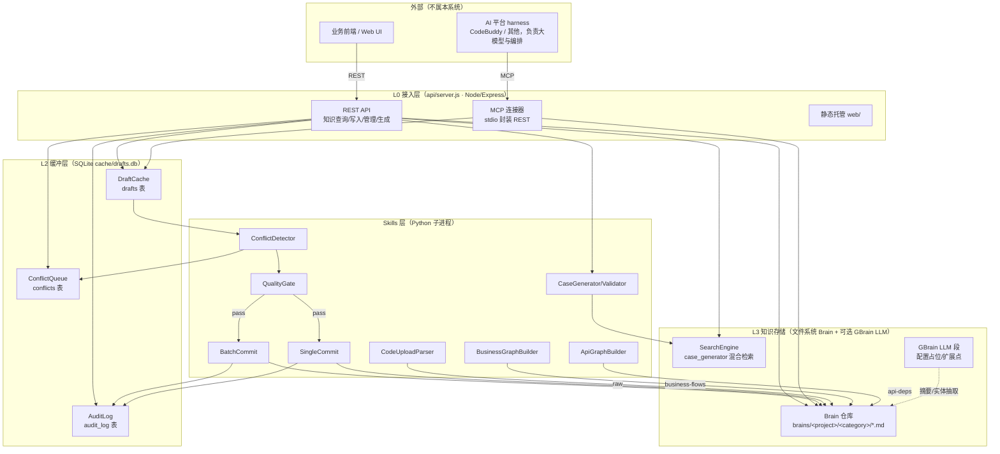

# 知识管理系统 V1.2 架构设计与详细技术方案

> 本文档随代码通过 Git 管理，是设计文档的**唯一权威来源（Single Source of Truth）**。
> 对外 API 的字段级契约以 `docs/API-INTERFACE-DOC.md` 与前端 `web/src/api-docs-data.js` 为准（三者须保持一致）。
> 根目录同名文件为重定向索引，请勿在根目录维护副本。

---

## 1. 版本目标与范围

### 1.1 项目定位

知识管理系统（KnowledgeOS / `test-knowledge-system`）是**知识侧**系统，负责知识的结构化沉淀、检索、冲突检测、质量门控与入库。它本身**不承载 AI harness**（大模型调用、多轮对话编排由外部 AI 平台负责），而是通过 REST API 与 MCP 接口向「业务前端」与「AI 平台」提供知识查询/写入能力。

三方职责边界（三层 prompt 分离）：

| 层 | 归属 | 内容 | 示例 |
|----|------|------|------|
| 业务意图 | 业务页面 | 操作类型 + 业务参数 + 业务约束 | `操作=生成用例, PRD=xxx.md, 代码=src/` |
| 执行模板 | AI 平台 | 大模型指令 + 工具调用编排 + 输出格式 | `你是测试用例生成专家，先查质量规则库，再查 API 图谱，然后生成用例…` |
| 知识上下文 | 知识系统 | 检索结果 + 知识图谱 + Brain 页面 | 通过 REST / MCP 接口按需返回 |

### 1.2 版本范围变化（相对 V1.0）

| 维度 | V1.0 | V1.2 |
|------|------|------|
| 运行架构 | 文档描述为「全链路 Python / GBrain 内核 / PGLite」 | **Node/Express 网关 + Python 子进程 Skills + 文件系统型 Brain 仓库 + SQLite 草稿缓冲**（GBrain 退化为可选智能 LLM 通道，仅配置占位） |
| 项目模型 | 单人单库（单一 `brain/`） | **多项目知识库隔离 + `_shared` 共享库**，通过 `project` 参数与 `config/projects.json` 路由 |
| 知识浏览 | 基础列表/详情 | 新增**项目 Wiki 页**（轻量 Markdown 渲染 + [[wikilink]] + 页面内目录）、**系统设置页**、**双模式图谱可视化**（API 依赖 / 业务实体） |
| 业务图谱 | `generate` 单步全量生成（易因文档超长超时/失败） | **渐进式分治生成 pipeline**：`plan → scenario(BFS) → optimize`，AI 规划优先、确定性骨架兜底，前端带进度浮层 |
| 人工编辑 | 直写盘 | **人工编辑优化闭环（propose-edit）**：编辑先生成 L2 草稿（knowledge_edit + quality_rule），确认后回写原仓库 |
| 冲突处理 | 仅标记 conflicts | **冲突处理闭环**：resolve 回写 drafts 并触发入库，草稿不再悬挂 |
| 可观测性 | 无统一日志 | **统一后台 JSON 日志**（应用 7 天 / LLM 请求响应 1 天，按天轮转） |
| AI 通道 | 单一 codebuddy | **codebuddy / openai / none 三通道 + 自定义模型（models.json）+ GBrain 段配置** |

### 1.3 PRD 需求覆盖清单（V1.2）

> ✅ = 已实现；⚠️ = 部分/扩展点未接活 LLM；❌ = 未实现

| # | PRD 需求 | 状态 | 实现位置 |
|---|----------|------|----------|
| 1 | 质量规则库管理（增删改查/分类） | ✅ | `brains/<p>/quality-rules/` + `POST /api/brain/pages[...]` + Web |
| 2 | 缺陷经验库沉淀 | ✅ | `brains/<p>/defect-experience/`、`defect_rule/` |
| 3 | 项目 Wiki 知识库 | ✅ | `brains/<p>/project-wiki/` + Wiki 页 + `/api/wiki/*` |
| 4 | 历史用例库 / 自动化脚本库 | ✅ | `brains/<p>/test-cases/`、`test-scripts/` |
| 5 | 原始素材独立溯源区（Raw） | ✅（V1.2） | `brains/<p>/raw/` + `code_upload_parser.py` |
| 6 | API 依赖图谱（自动化抽取） | ✅ | `api_graph_builder.py` + `GET /api/graph-data?mode=api` |
| 7 | 实体抽取闭环（PRD/需求→实体） | ✅（V1.2，确定性） | `GET /api/graph-data?mode=entity` + `buildEntityGraph` |
| 8 | LLM 智能摘要/语义抽取（GBrain） | ⚠️ | `ai_config.gbrain` 段配置占位，未接活实时 LLM |
| 9 | 业务场景依赖图谱（语义） | ✅ | `business_graph_builder.py` pipeline + `/business-graph/*` |
| 10 | 知识检索（关键词/语义） | ✅ | `case_generator.py` search + `POST /api/search` |
| 11 | 冲突检测 / 质量门控 | ✅ | `conflict_detector.py` / `quality_gate.py`（规则引擎，无 LLM） |
| 12 | 双通路入库（批量/单条） | ✅ | `batch_commit.py` / `single_commit.py` |
| 13 | 多项目隔离 / 共享 | ✅ | `config/projects.json` + `project` 参数 + `brains/` |
| 14 | 统一后台日志 | ✅ | `ai/llm_logger.py` + `api/logger.js` |

### 1.4 V1.2 新增能力说明

1. **Raw 独立溯源区**：`code_upload_parser.py` 解析上传源文件元数据，落盘 `brains/<p>/raw/`，与加工后的知识页面分离，保证「来源可追溯、加工可重放」。
2. **实体抽取闭环（确定性）**：`buildEntityGraph` 解析 PRD/需求文档的 H2/H3 标题为实体节点，同文档共现为 `related` 边，`[[wikilink]]` 为 `ref` 边，文档→实体为 `contains` 边；无需 LLM 即可可视化业务实体关系。
3. **渐进式业务图谱生成**：见 §6.2。
4. **人工编辑优化闭环**：见 §5.4。
5. **冲突处理闭环**：见 §5.3。
6. **多项目隔离 + 共享**：见 §7。
7. **统一后台日志**：见 §9.4。
8. **可折叠多选「聚焦模块」下拉**：业务图谱生成可按项目 Wiki 的 API 模块聚焦范围。

---

## 2. 技术栈选型（V1.2 实际）

| 层 | 选型 | 说明 |
|----|------|------|
| 接入/网关 | **Node.js + Express**（ESM） | `api/server.js` 提供全部 REST 路由 + 静态托管；默认端口 `3000`（环境变量 `PORT` 覆盖） |
| 功能脚本（Skills） | **Python ≥ 3.10**（子进程） | `skills/*.py`、`cache/*.py` 经 `child_process` 以 `shell:false` + `PYTHONUTF8=1` 调用，stdout 解析为 JSON 返回 |
| 知识存储 | **文件系统 Markdown（Brain 仓库）** | `brains/<project>/<category>/*.md`，YAML frontmatter 承载元数据；无外部向量库运行依赖 |
| 缓冲层 | **SQLite** | `cache/drafts.db`，表 `drafts` / `conflicts` / `audit_log` |
| 检索 | Python（关键词 + 可选语义） | `case_generator.py` 实现 RRF 风格混合检索 |
| 智能 LLM（可选） | 统一 AI 适配层 | `codebuddy` / `openai` / `none` 三通道；自定义模型经 `models.json`；GBrain 段仅配置占位 |
| 前端 | 原生 JS（无构建） | `web/` 静态资源由 Express 直接托管，`web/src/app.js` 单文件应用 |
| MCP | `mcp_connector/`（FastMCP stdio） | 将 REST 接口封装为 MCP 工具，供 AI 平台 harness 调用 |
| 日志 | 文件系统 JSON 行 | `ai/llm_logger.py` + `api/logger.js` → `logs/`（应用 7 天 / LLM 1 天，按天轮转） |

> 与 V1.0 文档的差异：V1.0 将原型期的「GBrain 内核 + PGLite 向量库 + Fat Skills（.md）」当作运行架构。V1.2 落地为**轻量可自托管**的 Node+Python 架构，GBrain 退化为可选智能增强通道（见 §9.3）。

---

## 3. 系统目录结构设计

```
test-knowledge-system/
├── api/                       # Node 接入层
│   ├── server.js              # Express 网关：全部 REST 路由 + 静态托管 + 请求日志/错误处理
│   └── logger.js              # Node 统一日志（JSON 行，logs/）
├── skills/                    # Python 功能脚本（subprocess 调用，详见 §12）
│   ├── business_graph_builder.py
│   ├── api_graph_builder.py
│   ├── batch_commit.py  single_commit.py
│   ├── conflict_detector.py  quality_gate.py
│   ├── case_generator.py   case_validator.py
│   ├── code_upload_parser.py  generate_quality_rule.py
│   └── tfidf_code_slicer.py
├── cache/                     # SQLite 数据层（Python）
│   ├── draft_cache.py         # drafts / 草稿状态机 / conflict 回写
│   ├── conflict_queue.py      # conflicts 表
│   └── audit_log.py           # audit_log 表
├── ai/                        # AI 适配层（Python）
│   ├── ai_config.py           # 读写 data/ai_config.json
│   ├── ai_adapter.py          # call_provider 三通道选择/回退
│   ├── codebuddy_client.py    # codebuddy CLI 调用（Windows 兼容修复）
│   └── llm_logger.py          # LLM 请求/响应日志（1 天轮转）
├── mcp_connector/             # MCP stdio 连接器（封装 REST）
│   ├── query_server.py        # 知识查询工具
│   └── write_server.py        # 知识写入工具
├── web/                       # 前端（无构建，静态托管）
│   ├── index.html
│   └── src/
│       ├── app.js             # 单文件应用：页面渲染/路由/业务编排
│       ├── api-docs-data.js   # API 文档单一数据源（与 API-INTERFACE-DOC.md 对齐）
│       └── styles.css
├── config/
│   └── projects.json          # 多项目定义（含 CATEGORIES 单源）
├── data/
│   └── ai_config.json         # AI 平台对接 + GBrain 段（持久化自设置页）
├── brains/                    # 文件系统知识库（按项目隔离）
│   ├── default/               # 默认项目私有库
│   │   ├── quality-rules/  defect_rule/  defect-experience/
│   │   ├── project-wiki/    raw/
│   │   └── test-cases/  test-scripts/
│   ├── _shared/               # 跨项目共享库（命中后写共享库）
│   └── <projectId>/           # 其他项目私有库（同 default 分类结构）
├── logs/                      # 运行/LLM 日志（gitignore）
├── docs/                      # 设计文档 + API 文档（单一权威来源）
└── start-systems.bat / .ps1   # 启动脚本（同时拉起 KS 与上游 BFF/前端）
```

---

## 4. 四个知识库与 Brain 仓库设计

### 4.1 分类（单一来源：`config/projects.json` 的 `CATEGORIES`）

| 分类目录 | 中文 | 说明 |
|----------|------|------|
| `quality-rules` | 质量规则 | 结构化质量规则（frontmatter `type=quality_rule`） |
| `defect_rule` | 缺陷规则 | 缺陷模式规则（仅经 BFF 回流/磁盘创建，不允许 PUT/DELETE 直写） |
| `defect-experience` | 缺陷经验 | 缺陷复盘经验 |
| `project-wiki` | 项目 Wiki | PRD/架构/需求/API 文档聚合，支撑 Wiki 页与业务图谱 |
| `raw` | 原始素材 | 上传源文件元数据，独立溯源 |
| `test-cases` | 测试用例 | 历史用例 |
| `test-scripts` | 自动化脚本 | 自动化脚本 |

> 质量监控的「类型覆盖」统计按**已发布 Brain 页面**的上述分类聚合（中文标签统一：quality-rules→质量规则，defect-experience→缺陷经验，defect_rule→缺陷规则，project-wiki→项目 Wiki，test-cases→测试用例，test-scripts→自动化脚本）。

### 4.2 页面格式（Markdown + frontmatter）

每个知识页面为一份 `.md` 文件，含 YAML frontmatter：

```markdown
---
title: 登录接口鉴权规则
type: quality_rule
createdAt: 2026-07-20T10:00:00+08:00
source: human_edit
repo: default
---
正文（Markdown：标题/列表/代码块等规范结构，质量门控据此评分）
```

`parseFrontmatter` 兼容 CRLF；详情接口额外返回 `title` / `body`（去 frontmatter），前端用 `renderMarkdown` 渲染。

### 4.3 多项目隔离下的 Brain 路由

- 私有库：`brains/<projectId>/<category>/`
- 共享库：`brains/_shared/<category>/`（跨项目复用）
- `metadata.repo` 命中 `_shared_brain_path` 时写共享库，否则写私有库（`_resolve_brain_dir`）。
- 前端 `currentProject` 持久化于 `localStorage('kb_currentProject')`，所有 REST 调用自动注入 `?project=` 或 body `project`。

---

## 5. L2 知识缓冲层（SQLite）

### 5.1 表结构

| 表 | 职责 | 关键字段 |
|----|------|----------|
| `drafts` | 待入库草稿 | `id, type, title, content, metadata(JSON), status, quality_score, conflict_id, createdAt` |
| `conflicts` | 冲突队列 | `id, draft_id, type, resolution, resolved_at` |
| `audit_log` | 操作审计 | `id, action, operator, target, project, created_at(ISO 带时区)` |

> 审计接口契约：`GET /api/audit-log` 返回 `{success, data:{items, total}}`；**分页参数名为 `pageSize`（非 `limit`）**；时间戳字段为 `created_at`（草稿用 `createdAt`，二者不可混用）。

### 5.2 草稿状态机

```
生成/回流 ──▶ pending
   │
   ├─ 冲突检测命中 ──▶ conflict ──(人工 resolve)──▶ pending(+single_commit 回写) / discarded
   │
   └─ 无冲突 ──▶ 质量门控
                     ├─ score ≥ 60 ──▶ (batch|single commit) ──▶ merged（写 Brain，清空草稿，写 audit）
                     └─ score < 60 ──▶ rejected（留 drafts，待人工审核）
```

终态：`merged` / `discarded` / `rejected`（前端列表过滤终态草稿）。

### 5.3 冲突处理闭环（V1.2 修复）

`resolve-conflict` / `resolve-conflicts` 子命令现在**回写 drafts 并触发入库**，形成闭环：

- `merge` / `overwrite` / `keep_both` → 先 `update_draft_status(pending)` 再 `single_commit`（保留质量门控，`skip_conflict_check=true`）；
- `discard` → `update_draft_status(discarded)`。

历史悬挂（仅标记 conflict 不回写）已清理：原 conflict 草稿按各自决议回写，8 条因质量门控保留为 pending（不悬挂）。

### 5.4 人工编辑优化闭环（propose-edit，V1.2 新增）

Wiki 页 `editBrainPage` 改调 `POST /api/brain/pages/:category/:id/propose-edit`（不再直写盘），生成**两条 L2 草稿**：

- **A. 知识修改草稿**（`type=knowledge_edit`，metadata 含 `category/pageId/repo/oldContent`）；
- **B. 质量规则草稿**（`type=quality_rule`，由 old/new 对比经 `generate_quality_rule.py` 提炼，AI 优先、失败回退确定性 diff）。

入库时 `batch_commit`：对 `knowledge_edit` 写回原仓库页面（所见即所得，不包 frontmatter；按 `metadata.repo` 命中共享库则写 `_shared`，否则私有库）；`quality_rule` 按 `BRAIN_TYPE_MAP` 落 `quality-rules`。原 `PUT /api/brain/pages` 直写盘逻辑保留作兼容。

---

## 6. 业务图谱

### 6.1 API 依赖图谱（确定性）

`api_graph_builder.py` 由代码结构 / API 文档抽取接口与调用关系，产出力导向图：

- `GET /api/graph-data?mode=api` 返回 API 依赖节点/边（前端力导向渲染）。
- 由 `tfidf_code_slicer.py` 解析代码接口与调用，确定性、无 LLM。

### 6.2 业务流程依赖知识图谱（渐进式分治，V1.2 重写）

定位：运行期功能模块 `skills/business_graph_builder.py`（非编码智能体技能）。业务依赖分析需结合文档推理，故主路径走 AI，确定性骨架兜底。

**三步 pipeline（`run_pipeline` BFS 驱动）**：

1. **plan**（`plan_scenarios`）：基于 project-wiki 索引做场景规划。
   - AI 优先：LLM 规划业务场景列表（结合 BFS 动态检索，种子场景 → 消费 → `related_modules` 入栈，带 `visited`/`max_depth`/`max_scenarios` 护栏）。
   - 兜底：确定性返回单全量场景（`det_global`，全局端点打分抽取骨架）。
2. **scenario**（`generate_scenario`）：逐场景检索聚焦模块 + 标签 + wikilink 邻居素材，送 LLM 生成该场景节点/边；失败回退 `scaffold`（由 API 文档端点抽骨架）。
3. **optimize**（`merge_graph`）：跨场景按标题归一化去重、合并边、稳定 id、业务域配色，产出完整图谱。

**端点（单一数据源见 `docs/API-INTERFACE-DOC.md` 第 11 节）**：

| 方法 | 路径 | 说明 |
|------|------|------|
| GET | `/api/business-graph` | 读取已入库图谱；未入库 `data` 为 `null` |
| POST | `/api/business-graph` | 从文档重新生成（`body.ai=false` 强制仅骨架），返回 `{source, valid, nodes, edges, flows, path, warnings}` |
| GET | `/business-graph/modules` | 返回 project-wiki 下 `api-*.md` 模块列表（聚焦下拉数据源） |
| POST | `/business-graph/plan` | 规划场景（`focus` 可指定聚焦模块） |
| POST | `/business-graph/scenario` | 生成单个场景（BFS，临时文件传参规避 Windows 命令行引号） |
| POST | `/business-graph/optimize` | 合并优化全部场景 |

**前端（bizflow 页）**：编排 `plan → 逐场景 scenario(BFS) → optimize`，右下角浮层显示进度（已生成 X / 待处理 Y / 新发现 Z → 整理优化 → 完成）；「聚焦模块」为**可折叠多选下拉**（默认全量，可多选缩小范围）。

**CLI 子命令**：`validate | md | scaffold | ingest | load | generate | plan | scenario | optimize`。

---

## 7. 多项目知识库隔离（V1.2 新增）

### 7.1 项目定义

`config/projects.json`：

```json
{
  "defaultProject": "default",
  "sharedBrain": "_shared",
  "categories": ["quality-rules", "defect_rule", "defect-experience", "project-wiki", "raw", "test-cases", "test-scripts"],
  "projects": [
    { "id": "default", "name": "默认项目", "description": "...", "brainPath": "brains/default" },
    { "id": "demo", "name": "Demo 项目", "description": "...", "brainPath": "brains/demo" }
  ]
}
```

### 7.2 路由与隔离

- `GET /api/projects` → `{ defaultProject, sharedBrain, projects[] }`，前端枚举与切换。
- 所有 `apiGet/apiPost/apiUpload` 自动注入 `project`（URL `?project=` 或 body `project`；调用方已显式指定则尊重原值，便于导入弹窗覆盖）。
- 顶部 `#project-select` 切换时重置图谱缓存/分页/角标并刷新当前页；导入弹窗 `#import-project` 默认跟随当前项目，可覆盖目标项目。
- 草稿/冲突/审计按 `project` 过滤；Brain 页面读取按项目目录隔离（`onProjectChange` 必须重置 `brainLoaded/brainPages`，否则切项目后列表串库）。

---

## 8. 知识流转全链路设计

### 8.0 全链路总览（V1.2 实际）



### 8.1 链路 1：API 依赖图谱更新（确定性）

`tfidf-code-slicer` → `api_graph_builder` → 写 `project-wiki`/更新 `GET /api/graph-data?mode=api`。无 LLM、无人工入口，数据驱动。

### 8.2 链路 2：业务场景图谱生成（AI 优先 + 兜底）

`business_graph_builder.run_pipeline`：plan（AI BFS / 确定性全量）→ scenario（LLM / scaffold）→ optimize（合并）→ 写 `brains/<p>/project-wiki/`（Layer 1 入库）+ `GET /api/business-graph` 读取（Layer 2 服务）。见 §6.2。

### 8.3 链路 3：人工编辑优化（propose-edit 闭环）

Wiki 页编辑 → `POST /api/brain/pages/:category/:id/propose-edit` → 生成 `knowledge_edit` + `quality_rule` 两条草稿 → 确认入库 → `batch_commit` 回写原仓库页面 + 落质量规则。见 §5.4。

### 8.4 链路 4：正式入库（双通路 + 冲突闭环）

`drafts(pending)` → `conflict-detector` → 有冲突写 `conflicts` → 人工 `resolve`（回写 pending + single_commit）/ 无冲突 → `quality-gate` ≥60 → `batch-commit` / `single-commit` → 写 Brain + 清空草稿 + 写 audit。见 §5.2–5.3。

### 8.5 链路 5：检索与知识回流

- 检索：`case_generator.py` 关键词 + 可选语义混合检索，`POST /api/search` 暴露。
- 回流：上传源文件经 `code_upload_parser` 落 `raw/`；业务图谱/API 图谱增量更新 `project-wiki`。

---

## 9. AI 适配层

### 9.1 通道选择

`ai/ai_adapter.call_provider(provider, ...)` 支持三通道，与 `generate_quality_rule.py` 同模式：

| 通道 | 实现 | 备注 |
|------|------|------|
| `codebuddy` | `codebuddy_client.py` 直接 `spawn(process.execPath, [全局 codebuddy 入口脚本, --output-format stream-json, ...], shell:false)` | Windows 兼容：绕开 cmd.exe，多行 prompt 不截断；`subprocess.run(encoding='utf-8', errors='replace')` 修复 gbk 解码崩溃 |
| `openai` | 直连 HTTP（base_url/api_key 来自配置） |  |
| `none` | 确定性回退 | 不调 LLM，返回骨架/兜底结果 |

### 9.2 自定义模型（models.json）

检测到 `cwd/.codebuddy/models.json` 或 `~/.codebuddy/models.json` 存在时，自动 `--setting-sources project,local` 加载设置源，解析其中注册的自定义模型（自有 url/apiKey）。配置 `ai.model` 须设为自定义 id（如 `kimi-k2.7-code`）且 `useCustomModel=true`，方可绕开 CLI 登录态直连自有端点。

### 9.3 GBrain 段（配置占位）

`data/ai_config.json` 的 `gbrain` 段用于对接 GBrain 大模型（Wiki 摘要 / 实体抽取等智能增强）。**当前仅作配置存储，尚未接入实时 LLM 调用**（扩展点）。

### 9.4 统一后台日志

- Python：`ai/llm_logger.py`（`TimedRotatingFileHandler` → `logs/app.log` 与 `logs/llm/app-llm.log`，分别 7 天 / 1 天，启动按 mtime 清理）。
- Node：`api/logger.js`（按天日期文件 `logs/app-YYYY-MM-DD.log`、`logs/llm/app-llm-YYYY-MM-DD.log`）。
- 记录内容：HTTP 请求（方法/路径/状态/耗时）、进程级异常、LLM 调用（provider/model/耗时/成功失败/error/`prompt`/`response`）。`extra` 字段避开 `module` 等内建名（已改为 `src`）。
- `logs/` 已加入 `.gitignore`。

---

## 10. MCP 接口设计

### 10.1 设计定位

两个 MCP 接口（知识查询 / 知识写入）**不是 AI 智能体**，而是知识系统的接口服务。`mcp_connector/` 基于 FastMCP 实现 stdio 服务器，将本系统 REST 接口封装为 MCP 工具，由 AI 平台 harness 调用编排。

完整链路：业务页面 → 提交业务意图 → AI 平台选执行模板 → AI 平台调知识系统 MCP 取上下文 → 拼接 prompt → 调大模型 → 调知识系统 MCP 写草稿 → 返回。

### 10.2 两个连接器

| 连接器 | 文件 | 暴露能力 |
|--------|------|----------|
| 知识查询 | `mcp_connector/query_server.py` | 搜索、Brain 页面读取、图谱/依赖读取（只读） |
| 知识写入 | `mcp_connector/write_server.py` | 草稿写入、冲突处理、入库、业务图谱重建（读写，受权限边界约束） |

权限边界：MCP 查询只读 Brain + 写 drafts；MCP 写入经 Skills 写正式库；AI 平台负责 harness/大模型/对话编排，本系统不持有。

---

## 11. Web UI（前端，无构建）

`web/src/app.js` 单文件应用，按 `data-page` 切换视图。主要页面：

| data-page | 页面 | 能力 |
|-----------|------|------|
| `dashboard` | 总览 | 统计角标、质量监控（类型覆盖按已发布 Brain 分类） |
| `drafts` | 草稿箱 | 待处理（pending）列表、单条/批量确认 |
| `conflicts` | 冲突处理 | 合并/覆盖/保留双方/丢弃，闭环回写 |
| `audit` | 审计日志 | 趋势与明细（读 `created_at`） |
| `graph` | 图谱可视化 | **双模式**：`api`（API 依赖力导向）/ `entity`（PRD/需求实体图） |
| `wiki` | 项目 Wiki | 索引目录（按 prd/req/api/其它分组）+ 轻量 Markdown 渲染 + `[[wikilink]]` + 页面内目录 |
| `settings` | 系统设置 | `GET/PUT /api/ai-settings`（AI 平台对接 ai 段 + GBrain 段），持久化 `data/ai_config.json` |
| `bizflow` | 业务图谱 | 渐进式 plan→scenario→optimize，进度浮层 + 聚焦模块多选下拉 |
| `search` / `upload` | 检索 / 上传 | `POST /api/search`、`POST /api/source-upload` |

顶部栏：`#project-select` 项目切换下拉 + `#current-project-label` 当前项目名。

---

## 12. 关键 Skill 定义（Python 子进程）

| Skill | 文件 | 输入 | 输出 | LLM | 说明 |
|-------|------|------|------|-----|------|
| 业务图谱构建 | `business_graph_builder.py` | project-wiki（架构/PRD/API） | `business-flows.json` + `.md` | 是（优先） | plan/scenario/optimize 分治 + 确定性兜底 |
| API 图谱构建 | `api_graph_builder.py` | 代码/API 文档 | API 依赖图 | 否 | 确定性 |
| 代码切片 | `tfidf_code_slicer.py` | 代码路径 | 接口+调用 JSON | 否 | 确定性 |
| 冲突检测 | `conflict_detector.py` | 草稿 + 质量规则 | 冲突列表 | 否（规则引擎） | 入库前强制 |
| 质量门控 | `quality_gate.py` | 草稿 | 评分(0-100)+通过/拒绝 | 否（规则引擎） | 阈值 60 |
| 批量入库 | `batch_commit.py` | 全量 pending | 入库结果 | 否 | 主通路；knowledge_edit 回写原页 |
| 单条入库 | `single_commit.py` | 单条草稿 | 入库结果 | 否 | 兜底通路 |
| 用例生成 | `case_generator.py` | 存量知识 | 测试用例 + 检索 | 否（仅检索） | 生成逻辑在 AI 平台 |
| 用例校验 | `case_validator.py` | 规则+图谱 | 校验结果 | 否 | 校验逻辑在 AI 平台 |
| 源文件解析 | `code_upload_parser.py` | 上传源文件 | 元数据 + raw 落盘 | 否 | Raw 溯源 |
| 质量规则生成 | `generate_quality_rule.py` | old/new diff | 质量规则草稿 | 是（优先） | propose-edit 用 |

> 业务图谱 `business_graph_builder.py` CLI：`validate | md | scaffold | ingest | load | generate | plan | scenario | optimize`。

---

## 13. 部署与运维

### 13.1 环境要求

| 组件 | 要求 |
|------|------|
| 操作系统 | Linux / macOS / Windows（WSL2 推荐） |
| Node.js | ≥ 18（Express 网关） |
| Python | ≥ 3.10（Skills / 数据层） |
| 磁盘 | ≥ 1GB（Brain + 缓存 + 日志） |
| 网络 | 可选：MaaS / 自有模型端点（仅 AI 生成需要） |

### 13.2 启动

```bash
cd test-knowledge-system
npm install
node api/server.js            # 默认端口 3000；或 npm start
# 可选：启动 MCP 连接器（stdio，供 AI 平台连接）
python mcp_connector/query_server.py
python mcp_connector/write_server.py
```

`start-systems.bat` / `start-systems.ps1` 可一并拉起上游 BFF（:4123）与知识系统（:3000）。

### 13.3 运维要点

- **统一日志**：`logs/app-*.log`（7 天）、`logs/llm/app-llm-*.log`（1 天），JSON 行，便于 grep/jq；交付后主要靠日志诊断。
- **多项目**：新增项目在 `config/projects.json` 的 `projects` 追加并建 `brains/<id>/` 目录。
- **编码**：Windows 下 Python 子进程以 `PYTHONUTF8=1` + `shell:false` 启动，避免中文/空格参数拆分与 GBK 解码崩溃；上传非 ASCII 文件名经 undici 时需 ASCII 文件名 + Latin-1 反解兜底（见 `api/server.js` `readTextFile` / `source-upload`）。

---

## 14. 对外 API 总览

完整字段级契约见 `docs/API-INTERFACE-DOC.md`（与 `web/src/api-docs-data.js` 为单一数据源，改动须同步）。按群组：

| 群组 | 端点（节） |
|------|-----------|
| 项目 | `GET /api/projects`（§3） |
| 草稿 | `GET/POST /api/drafts`、`POST /api/drafts/:id/commit`、`GET /api/drafts/pending`（§4） |
| 冲突 | `GET /api/conflicts`、`POST /api/conflicts/:id/resolve`、`POST /api/conflicts/resolve`（§5） |
| 质量门控 | `POST /api/quality-gate`（§6） |
| 审计 | `GET /api/audit-log`（§8，分页 `pageSize`，时间戳 `created_at`） |
| 统计 | `GET /api/stats`（§9） |
| 检索 | `POST /api/search`（§10） |
| 源上传 | `POST /api/source-upload`（§12，非 ASCII 文件名加固） |
| Wiki | `GET /api/wiki-modules`、`GET /api/wiki/api-deps`（§13） |
| Brain 页面 | `GET/POST/PUT/DELETE /api/brain/pages`、`POST /api/brain/pages/batch`、`POST /api/brain/pages/:category/:id/propose-edit`（§14） |
| 图谱 | `GET /api/graph-data?mode=api|entity`（§15） |
| 业务图谱 | `GET/POST /api/business-graph`、`GET /business-graph/modules`、`POST /business-graph/plan|scenario|optimize`（§11） |
| 设置 | `GET/PUT /api/ai-settings`（§16） |
| 质量规则生成 | `POST /api/generate-quality-rule`（§17） |
| 用例生成 | `POST /api/generate-cases`（§18） |
| MCP | `mcp_connector/query_server.py`、`write_server.py`（§7 / §10） |

> 统一返回结构：`{ success, data, error }`；列表类接口返回 `{ success, data:{ items, total, ...} }` 信封（禁止裸数组）；字段名须与文档 `responseExample` 完全一致（审计 `created_at` / 草稿 `createdAt` 不可混用）。

---

## 15. V1.0 → V1.2 变更清单（修复与更新）

### 15.1 架构与运行

- 落地 **Node/Express 网关 + Python 子进程 Skills + 文件型 Brain + SQLite**，替代 V1.0 原型的 GBrain/PGLite 描述；GBrain 降级为可选 LLM 配置占位。
- 修复 Windows 下 Python 子进程调用：`shell:false` + `PYTHONUTF8=1`；`codebuddy_client.py` 改为 `shutil.which` + 已知前缀兜底，修复 gbk 解码崩溃（`encoding='utf-8', errors='replace'`）——该 gbk bug 曾是业务图谱「耗时久回退确定性」的真因。
- **统一后台日志**（应用 7 天 / LLM 1 天，JSON 行）。

### 15.2 多项目隔离

- 新增 `config/projects.json`、`GET /api/projects`、前端 `currentProject` 注入与 `#project-select` 切换。
- 修复跨项目冲突泄漏、跨项目列表串库（`onProjectChange` 重置 `brainLoaded/brainPages`）。
- Brain 入库按 `project` 隔离；统计/审计按 `project` 过滤。

### 15.3 知识浏览与可视化

- 新增**项目 Wiki 页**（轻量 Markdown + `[[wikilink]]` + 页面内目录 + API 依赖列表「在图谱中查看」跳转）。
- 新增**系统设置页**（`GET/PUT /api/ai-settings`，ai + gbrian 段，持久化 `data/ai_config.json`）。
- **双模式图谱可视化**：`mode=api`（API 依赖）/ `mode=entity`（PRD/需求实体，确定性抽取）。
- 业务图谱 **bizflow 页渐进式生成**（plan→scenario→optimize，进度浮层 + 聚焦模块多选下拉）。

### 15.4 闭环修复

- **人工编辑优化闭环**：`propose-edit` 生成 knowledge_edit + quality_rule 两条草稿，确认后回写原仓库。
- **冲突处理闭环**：`resolve` 回写 drafts 并触发入库，消除悬挂冲突。
- 审计日志契约修复：分页 `pageSize`、时间戳 `created_at`、count-audit 子命令参数齐全（真实 total）。
- 质量监控「类型覆盖」改为按已发布 Brain 页面分类统计（中文标签统一），与浏览计数一致。
- 脑图文件 CRLF 不一致：`write_text(..., newline='\n')` 统一 LF，保证前端读回与落盘逐字节一致。

### 15.5 上传与编码

- BFF 上传 PRD/代码经 undici 非 ASCII 文件名损坏内容的修复（memory buffer + ASCII 文件名 + Latin-1 反解 + `readTextFile` 加固）。
- Brain 端点新增 `POST /api/brain/pages`（单条）/ `batch`（批量），带 frontmatter + 审计；缺陷规则仅经 BFF 回流创建。

### 15.6 业务图谱生成重做

- 由单步 `generate` 全量生成，重做为 **plan/scenario/optimize 分治 pipeline**（AI BFS 规划优先、确定性单全量场景兜底），新增 `plan/scenario/optimize` 端点与 `/business-graph/modules`；合并阶段以 `title` 与 `id` 双键归一化去重，修复边丢失；CLI 经临时文件传参规避 Windows 命令行引号；`utf-8-sig` 容忍 BOM。

---

## 16. 版本历史

| 版本 | 日期 | 说明 |
|------|------|------|
| V1.0.0 | 方案基线 | 四知识库、L2 缓冲、三层 prompt 分离、MCP 设计、Skills 清单（原型期以 GBrain 内核描述） |
| V1.0.1 | API 文档 | `docs/API-INTERFACE-DOC.md` 字段级契约，与 `api-docs-data.js` 对齐 |
| V1.2 | 本文档 | 落地 Node+Python 轻量架构；多项目隔离；Wiki/设置/双模式图谱；业务图谱分治生成；propose-edit 与冲突处理双闭环；统一日志；自定义模型；全部闭环 bug 修复 |

---

> 附录：本系统不持有 AI harness。所有 LLM 调用经统一 AI 适配层（`codebuddy`/`openai`/`none` + 自定义模型），业务编排与多轮对话由外部 AI 平台负责；知识系统仅通过 REST 与 MCP 提供知识查询/写入能力。
